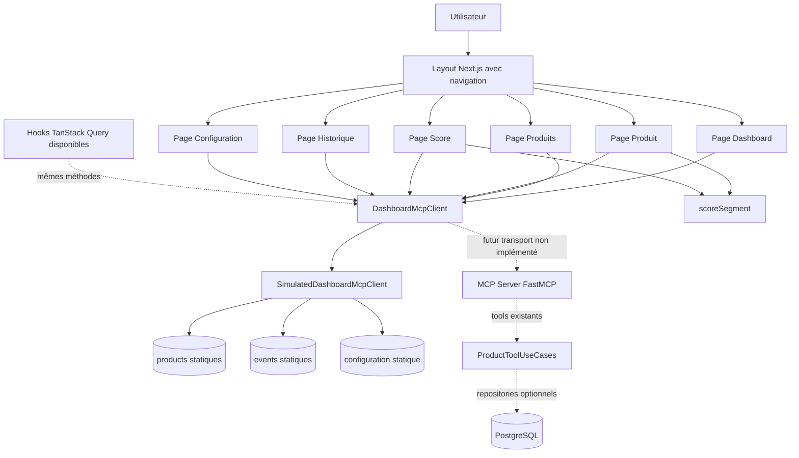
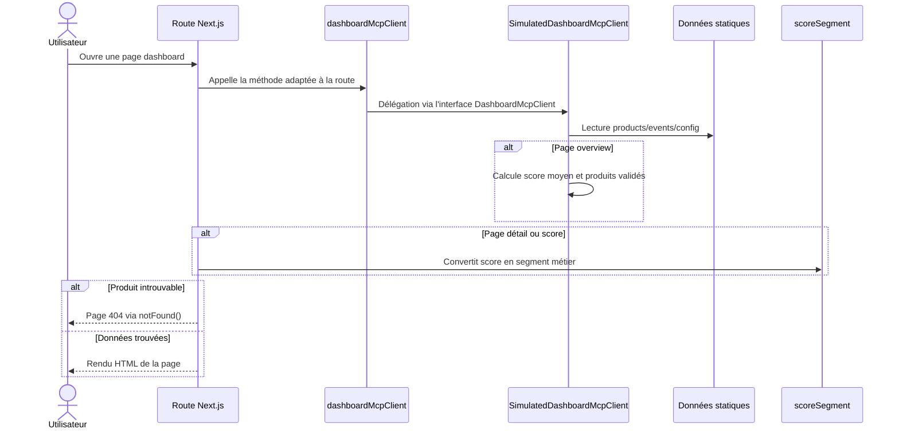
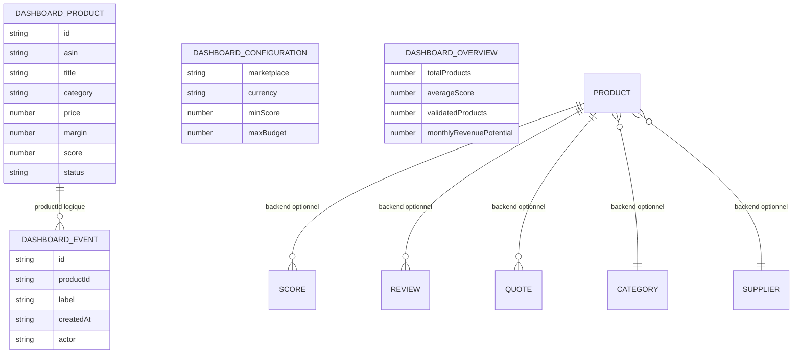

# Dashboard

> Statut : spécification fonctionnelle et technique basée uniquement sur le code présent au 2026-07-01.
>
> Périmètre : dashboard Next.js situé dans `frontend/`, types TypeScript de la frontière dashboard, client MCP simulé, requêtes TanStack Query disponibles, et dépendances avec les tools MCP/backend existants. Le document ne suppose pas de transport dashboard → MCP réel, d'API HTTP backend publique, ni de persistance effectivement consommée par le dashboard.

## 1. Présentation

### But de la fonctionnalité

Le Dashboard fournit une interface web privée pour consulter des opportunités Amazon FBA, leurs scores, leur statut, leur historique d'analyse et les paramètres métier utilisés par la frontière MCP dashboard.

Dans l'état actuel du repository, la fonctionnalité est une application Next.js App Router alimentée par l'interface `DashboardMcpClient`. L'implémentation concrète disponible est `SimulatedDashboardMcpClient`, qui retourne des données statiques en mémoire. Cette séparation permet de remplacer ultérieurement le simulateur par un adaptateur de transport MCP réel sans modifier les pages métier.

### Objectifs métier

- Donner une vue exécutive des opportunités produit FBA.
- Afficher les produits à investiguer, surveiller ou rejeter.
- Rendre visibles le score, la marge, le prix, l'ASIN, la catégorie et le statut métier d'un produit.
- Fournir un historique lisible des événements d'analyse ou de décision.
- Centraliser des paramètres dashboard : marketplace, devise, score minimum et budget maximum.
- Préserver une interface utilisateur découplée des connecteurs fournisseurs et des repositories backend.

### Utilisateurs concernés

- **Utilisateur métier / opérateur FBA** : consulte les métriques, les produits, les détails, les scores, l'historique et la configuration.
- **Développeur frontend** : maintient les pages Next.js, les types dashboard, les composants UI, les query hooks et le client MCP dashboard.
- **Développeur MCP** : maintient les tools MCP et prépare l'éventuel transport réel consommable par le dashboard.
- **Développeur backend** : maintient les use cases et services dont les données pourront alimenter un futur adaptateur dashboard réel.
- **Agent ou orchestrateur IA** : n'utilise pas directement le dashboard actuel, mais peut alimenter les mêmes concepts via les tools MCP existants.

### Limites actuelles

- Le dashboard ne contacte pas le serveur MCP FastMCP réel ; il utilise exclusivement `SimulatedDashboardMcpClient`.
- Les données produits, événements et configuration sont codées en dur dans `frontend/src/lib/mcp/client.ts`.
- Les pages App Router appellent directement le client simulé côté serveur ; les hooks TanStack Query existent mais ne sont pas utilisés par les pages actuelles.
- Aucun formulaire de recherche, déclenchement MCP, mutation ou action utilisateur persistante n'est implémenté.
- Aucun mécanisme d'authentification, autorisation ou session utilisateur n'est présent dans le frontend.
- Le dashboard n'écrit pas en base de données et ne lit pas les repositories SQLAlchemy.
- La configuration affichée n'est pas chargée depuis les variables d'environnement ni depuis `McpServerSettings`.
- Les statuts dashboard sont limités à `watch`, `validated` et `rejected`.
- Les segments de score frontend sont calculés localement par `scoreSegment()` et ne proviennent pas d'un service backend.

## 2. Cas d'utilisation

### UC1 — Consulter la vue d'ensemble

- **Description** : l'utilisateur ouvre la page racine du dashboard pour obtenir les métriques exécutives.
- **Entrée** : aucune entrée utilisateur ; la page appelle `dashboardMcpClient.getOverview()`.
- **Sortie** : `DashboardOverview` avec `totalProducts`, `averageScore`, `validatedProducts` et `monthlyRevenuePotential`.
- **Résultat attendu** : quatre cartes affichent le nombre de produits, le score moyen arrondi, le nombre de produits validés et le potentiel mensuel formaté en dollars.

### UC2 — Lister les produits

- **Description** : l'utilisateur consulte la liste des opportunités produit.
- **Entrée** : aucune entrée utilisateur ; la page appelle `dashboardMcpClient.listProducts()`.
- **Sortie** : liste de `DashboardProduct`.
- **Résultat attendu** : chaque produit affiche le titre, l'ASIN, la catégorie, le statut, le score et un lien vers la page détail.

### UC3 — Consulter le détail d'un produit

- **Description** : l'utilisateur ouvre `/products/[id]` pour voir les métriques principales d'un produit.
- **Entrée** : paramètre de route `id`.
- **Sortie** : `DashboardProduct` ou `undefined`.
- **Résultat attendu** : si le produit existe, la page affiche prix, marge et score avec segment métier ; sinon Next.js déclenche `notFound()`.

### UC4 — Consulter la page Score

- **Description** : l'utilisateur compare les scores de tous les produits.
- **Entrée** : aucune entrée utilisateur ; la page appelle `dashboardMcpClient.listProducts()`.
- **Sortie** : liste de produits avec score numérique.
- **Résultat attendu** : chaque produit est affiché avec son segment (`opportunité`, `surveillance`, `risque`) et une barre de progression proportionnelle au score.

### UC5 — Consulter l'historique

- **Description** : l'utilisateur consulte les événements d'analyse et de décision.
- **Entrée** : aucune entrée utilisateur ; la page appelle `dashboardMcpClient.listEvents()`.
- **Sortie** : liste de `DashboardEvent`.
- **Résultat attendu** : chaque événement affiche son libellé, sa date formatée en locale `fr-FR` et son acteur (`mcp`, `agent` ou `user`).

### UC6 — Consulter la configuration

- **Description** : l'utilisateur consulte les paramètres métier exposés au dashboard.
- **Entrée** : aucune entrée utilisateur ; la page appelle `dashboardMcpClient.getConfiguration()`.
- **Sortie** : `DashboardConfiguration`.
- **Résultat attendu** : la page affiche marketplace, devise, score minimum et budget maximum.

### UC7 — Segmenter un produit par score

- **Description** : le frontend transforme un score numérique en libellé métier lisible.
- **Entrée** : objet contenant `score`.
- **Sortie** : `opportunité`, `surveillance` ou `risque`.
- **Résultat attendu** : score `>= 80` → `opportunité`, score `>= 60` → `surveillance`, sinon `risque`.

### UC8 — Préparer une consommation client via TanStack Query

- **Description** : des hooks existent pour charger les mêmes données depuis la frontière MCP dans de futurs composants client.
- **Entrée** : appels `useDashboardOverview()`, `useProducts()`, `useProduct(id)`, `useDashboardEvents()` ou `useDashboardConfiguration()`.
- **Sortie** : objets `useQuery` basés sur les clés stables `dashboardQueryKeys`.
- **Résultat attendu** : les query hooks restent alignés sur `DashboardMcpClient`, même si les pages actuelles sont des composants serveur.

## 3. Architecture

### Modules impliqués

- `frontend/src/app/layout.tsx` : layout global, navigation latérale et métadonnées.
- `frontend/src/app/page.tsx` : page overview.
- `frontend/src/app/products/page.tsx` : liste produits.
- `frontend/src/app/products/[id]/page.tsx` : détail produit.
- `frontend/src/app/score/page.tsx` : visualisation des scores.
- `frontend/src/app/history/page.tsx` : historique des événements.
- `frontend/src/app/configuration/page.tsx` : configuration affichée.
- `frontend/src/app/providers.tsx` : fournisseur React Query côté client.
- `frontend/src/lib/mcp/client.ts` : contrat `DashboardMcpClient`, données simulées et implémentation `SimulatedDashboardMcpClient`.
- `frontend/src/types/dashboard.ts` : types `DashboardProduct`, `DashboardEvent`, `DashboardConfiguration` et `DashboardOverview`.
- `frontend/src/features/*/queries.ts` : hooks TanStack Query pour chaque zone fonctionnelle.
- `frontend/src/features/score/score.ts` : segmentation métier d'un score.
- `frontend/src/lib/query/keys.ts` : clés stables TanStack Query.
- `frontend/src/components/ui/card.tsx` et `frontend/src/components/ui/badge.tsx` : composants UI réutilisables.

### Services

- **Service frontend simulé** : `SimulatedDashboardMcpClient`, qui implémente le contrat dashboard et calcule localement la vue d'ensemble.
- **Service MCP réel existant dans le repository, non consommé par le dashboard actuel** : serveur FastMCP avec `search_products`, `analyse_product`, `calculate_margin` et `score_product`.
- **Services backend indirectement concernés pour une évolution future** : `ProductToolUseCases`, `ProductResearchService`, `MarginService` et `ScoreService`.

### Outils MCP

Aucun tool MCP n'est appelé par le dashboard actuel. Les tools existants qui correspondent aux concepts affichés sont :

- `search_products` pour la découverte produit.
- `analyse_product` pour l'analyse structurée.
- `calculate_margin` pour la marge.
- `score_product` pour le scoring.

### Connecteurs

Le dashboard actuel n'utilise aucun connecteur fournisseur. Les connecteurs Amazon, Keepa, Bright Data et OpenAI existent côté backend, mais ne sont pas importés dans `frontend/`. Dans le graphe MCP local, `LocalAmazonConnector` et `LocalKeepaConnector` alimentent les tools produit, mais pas le dashboard simulé.

### Base de données

Le dashboard actuel n'accède pas à PostgreSQL. Le modèle persistant du projet contient toutefois des entités alignées avec les concepts affichés : `Product`, `Category`, `Supplier`, `Review`, `Score`, `Quote` et `Email`. Aucune requête frontend ou API dashboard ne lit ces tables aujourd'hui.

### Dépendances

- Next.js App Router.
- React et React DOM.
- TypeScript.
- TanStack React Query.
- Tailwind CSS et utilitaires UI (`clsx`, `tailwind-merge`, `class-variance-authority`).
- Vitest et Testing Library pour les tests frontend.
- FastMCP, Pydantic, SQLAlchemy et services backend sont des dépendances conceptuelles pour l'évolution vers un dashboard connecté, pas des dépendances d'exécution directes du frontend actuel.

### Diagramme Mermaid



## 4. Flux d'exécution

### Flux complet actuel

1. L'utilisateur charge une route Next.js : `/`, `/products`, `/products/[id]`, `/score`, `/history` ou `/configuration`.
2. `RootLayout` rend la structure globale, le menu de navigation et le contenu de la page.
3. La page serveur concernée importe `dashboardMcpClient`.
4. `dashboardMcpClient` pointe vers une instance unique de `SimulatedDashboardMcpClient`.
5. La méthode correspondant à la page est appelée : `getOverview`, `listProducts`, `getProduct`, `listEvents` ou `getConfiguration`.
6. Le client simulé lit les tableaux ou objets statiques définis dans `frontend/src/lib/mcp/client.ts`.
7. Pour l'overview, le client calcule `averageScore` par moyenne des scores, `validatedProducts` par filtrage du statut `validated`, puis retourne un potentiel mensuel constant.
8. Pour un détail produit, si aucun produit ne correspond à l'`id`, la page appelle `notFound()`.
9. Les pages `products/[id]` et `score` appellent `scoreSegment()` pour convertir le score numérique en segment métier.
10. La page retourne le HTML React rendu par Next.js.
11. Aucun appel réseau MCP, backend ou base de données n'est effectué par ce flux.

### Diagramme Mermaid



## 5. Outils MCP utilisés

### État actuel

Aucun outil MCP n'est utilisé directement par le dashboard. Le libellé "MCP" du client frontend désigne une frontière d'abstraction (`DashboardMcpClient`) et non un transport MCP effectif.

### Tools MCP existants et rôle futur possible

#### `search_products`

- **Rôle** : rechercher des candidats produit.
- **Paramètres** : `query`, `marketplace`, `limit`.
- **Retour** : enveloppe `ToolResponse` contenant une liste de `ProductSummary`.
- **Dépendances** : `SearchProductsRequest`, `BackendProductResearchService`, `ProductToolUseCases.search_products()`, `ProductResearchService`, `LocalAmazonConnector` et `LocalKeepaConnector` dans le graphe local MCP.

#### `analyse_product`

- **Rôle** : fournir une analyse structurée d'un ASIN.
- **Paramètres** : `asin`, `marketplace`.
- **Retour** : enveloppe `ToolResponse` contenant `ProductAnalysis`.
- **Dépendances** : `AnalyseProductRequest`, `ProductToolUseCases.analyse_product()` et service de recherche produit backend.

#### `calculate_margin`

- **Rôle** : calculer la marge FBA à partir de montants validés.
- **Paramètres** : `sale_price`, `landed_cost`, `amazon_fees`, `fulfillment_cost`.
- **Retour** : enveloppe `ToolResponse` contenant `MarginBreakdown`.
- **Dépendances** : `CalculateMarginRequest`, `ProductToolUseCases.calculate_margin()` et `MarginService`.

#### `score_product`

- **Rôle** : produire un score décisionnel pour un produit.
- **Paramètres** : `asin`, `monthly_sales_estimate`, `review_count`, `margin_percent`.
- **Retour** : enveloppe `ToolResponse` contenant `ProductScore`.
- **Dépendances** : `ScoreProductRequest`, `ProductToolUseCases.score_product()` et `ScoreService`.

## 6. Services impliqués

### `SimulatedDashboardMcpClient`

- **Responsabilités** : fournir au dashboard des produits, événements, configuration et métriques overview sans transport externe.
- **Dépendances** : types dashboard TypeScript et données statiques locales.
- **Comportements notables** : calcule `averageScore` et `validatedProducts`; retourne `monthlyRevenuePotential = 12840`.

### `scoreSegment`

- **Responsabilités** : convertir un score numérique en segment d'affichage.
- **Dépendances** : type partiel compatible `DashboardProduct`.
- **Règles** : `>= 80` opportunité, `>= 60` surveillance, sinon risque.

### Query hooks frontend

- **Responsabilités** : préparer un accès client TanStack Query aux méthodes de `DashboardMcpClient`.
- **Dépendances** : `@tanstack/react-query`, `dashboardMcpClient` et `dashboardQueryKeys`.
- **Limite actuelle** : les pages existantes n'utilisent pas ces hooks ; elles appellent le client depuis des composants serveur.

### Serveur MCP FastMCP

- **Responsabilités** : enregistrer les tools produit, configurer le logging et convertir les erreurs en réponses contrôlées via `_safe_tool`.
- **Dépendances** : `FastMCP`, `McpServerSettings`, schemas Pydantic et tools MCP.
- **Relation au dashboard** : non appelé directement à ce jour.

### `ProductToolUseCases`

- **Responsabilités** : orchestrer recherche, analyse, marge et scoring côté backend pour les protocoles comme MCP.
- **Dépendances** : `ProductResearchService`, `MarginService`, `ScoreService` et tracer optionnel.
- **Relation au dashboard** : source probable pour un futur adaptateur réel, non utilisée par le simulateur frontend.

## 7. Connecteurs

### Connecteurs utilisés par le dashboard actuel

Aucun connecteur externe n'est utilisé par le dashboard actuel.

### Connecteurs présents dans le projet et pertinents pour une évolution

- **`LocalAmazonConnector`** : utilisé par le graphe MCP local pour fournir des résultats Amazon simulés. Pertinent si le dashboard consomme `search_products` via MCP.
- **`LocalKeepaConnector`** : utilisé par le graphe MCP local pour fournir une analytics Keepa simulée. Pertinent si le dashboard consomme des analyses produit via MCP.
- **Connecteur Amazon réel** : présent côté backend, non injecté dans le dashboard ni dans le graphe MCP local actuel.
- **Connecteur Keepa réel** : présent côté backend, non injecté dans le dashboard ni dans le graphe MCP local actuel.
- **Connecteur Bright Data** : présent côté backend, non utilisé par le dashboard actuel.
- **Connecteur OpenAI** : présent côté backend pour des analyses IA, non utilisé par le dashboard actuel.

## 8. Modèle de données

### Entités frontend effectives

#### `DashboardProduct`

- `id` : identifiant dashboard utilisé dans les routes.
- `asin` : identifiant Amazon.
- `title` : titre produit.
- `category` : catégorie affichée.
- `price` : prix numérique.
- `margin` : marge décimale, affichée en pourcentage après multiplication par 100.
- `score` : score numérique sur 100.
- `status` : `watch`, `validated` ou `rejected`.

#### `DashboardEvent`

- `id` : identifiant événement.
- `productId` : identifiant dashboard du produit associé.
- `label` : description de l'événement.
- `createdAt` : date ISO.
- `actor` : `mcp`, `agent` ou `user`.

#### `DashboardConfiguration`

- `marketplace` : marketplace affichée.
- `currency` : devise.
- `minScore` : score minimum.
- `maxBudget` : budget maximum.

#### `DashboardOverview`

- `totalProducts` : nombre total de produits.
- `averageScore` : score moyen arrondi.
- `validatedProducts` : nombre de produits au statut `validated`.
- `monthlyRevenuePotential` : potentiel mensuel affiché.

### Entités persistantes backend alignées mais non consommées

- `Product` : produit candidat normalisé.
- `Category` : catégorie produit.
- `Supplier` : fournisseur.
- `Review` : revue humaine.
- `Score` : score calculé.
- `Quote` : devis fournisseur.
- `Email` : email fournisseur.

### Relations

- Dans le frontend simulé, `DashboardEvent.productId` référence logiquement `DashboardProduct.id`, sans contrainte technique.
- Dans le backend persistant, `Product` peut être lié à `Category`, `Supplier`, `Review`, `Score`, `Quote` et `Email`.
- Aucun mapping automatique entre `DashboardProduct` et `Product` SQLAlchemy n'est implémenté.

### Diagramme Mermaid



## 9. Algorithme

### Algorithme de génération de la vue d'ensemble

Pseudo-code :

```text
charger la liste statique products
calculer totalProducts = nombre de produits
calculer sommeScores = somme de product.score pour chaque produit
calculer averageScore = arrondi(sommeScores / totalProducts)
calculer validatedProducts = nombre de produits dont status == "validated"
fixer monthlyRevenuePotential = 12840
retourner DashboardOverview(totalProducts, averageScore, validatedProducts, monthlyRevenuePotential)
```

### Algorithme de liste produits

```text
retourner le tableau statique products sans filtrage ni pagination
```

### Algorithme de détail produit

```text
recevoir id depuis la route
chercher le premier produit dont product.id == id
si aucun produit n'est trouvé : déclencher notFound()
sinon : afficher prix, marge et score
calculer segment = scoreSegment(product)
afficher segment avec le score
```

### Algorithme de segmentation score

```text
si score >= 80 : retourner "opportunité"
sinon si score >= 60 : retourner "surveillance"
sinon : retourner "risque"
```

### Algorithme de rendu historique

```text
charger la liste statique events
pour chaque événement :
  convertir createdAt en Date
  formater avec la locale fr-FR
  afficher label, date formatée et actor
```

### Algorithme de configuration

```text
retourner l'objet statique :
  marketplace = "Amazon US"
  currency = "USD"
  minScore = 70
  maxBudget = 2500
```

## 10. Configuration

### Variables d'environnement

Aucune variable d'environnement frontend spécifique au dashboard n'est définie dans le code actuel.

Variables globales du repository pertinentes mais non consommées par le dashboard :

- `APP_ENV` : environnement applicatif backend/MCP.
- `LOG_LEVEL` : niveau de logs backend/MCP.
- `DATABASE_URL` et variables PostgreSQL : configuration de persistance backend.
- `BACKEND_BASE_URL` : présent dans `McpServerSettings`, non utilisé par les tools actuels ni par le dashboard.
- `MCP_SERVER_NAME` : nom du serveur MCP.

### Paramètres dashboard statiques

- `marketplace` : `Amazon US`.
- `currency` : `USD`.
- `minScore` : `70`.
- `maxBudget` : `2500`.
- `monthlyRevenuePotential` : `12840`.

### Pondérations

Le dashboard ne définit aucune pondération. Les pondérations métier de scoring existent dans `backend/src/fba_advisor/services/score/config.yaml`, mais la segmentation frontend n'utilise que deux seuils codés en dur : 80 et 60.

### Fichiers de configuration

- `frontend/package.json` : scripts et dépendances du dashboard.
- `frontend/next.config.ts` : configuration Next.js.
- `frontend/tsconfig.json` : configuration TypeScript.
- `frontend/tailwind.config.ts` et `frontend/postcss.config.mjs` : configuration CSS.
- `frontend/eslint.config.mjs` : configuration lint.
- `frontend/vitest.config.ts` : configuration de tests frontend.

## 11. Gestion des erreurs

### Erreurs possibles

- Produit introuvable pour `/products/[id]`.
- Données simulées vides, notamment division par zéro possible dans `getOverview()` si `products` devient vide.
- Score hors plage visuelle si un futur produit simulé dépasse `100` ou descend sous `0`.
- Date d'événement invalide entraînant un affichage de date incorrect.
- Erreur future de transport MCP si un adaptateur réel remplace le simulateur.
- Incohérence de type si les données réelles ne respectent pas `DashboardProduct`, `DashboardEvent` ou `DashboardConfiguration`.

### Comportement attendu

- Produit introuvable : afficher la page 404 Next.js via `notFound()`.
- Erreur de rendu serveur : laisser Next.js gérer l'erreur selon sa configuration actuelle.
- Erreur de validation future : la frontière `DashboardMcpClient` devra normaliser ou rejeter les données avant de les exposer aux pages.
- Erreur MCP future : afficher une erreur contrôlée et ne pas exposer les détails sensibles au navigateur.

### Stratégie de reprise

- Conserver le simulateur comme fallback de développement uniquement si explicitement choisi.
- Ajouter une gestion d'état erreur dans les composants client si les hooks TanStack Query deviennent la voie principale.
- Ajouter des gardes sur tableaux vides et scores hors bornes avant de connecter des données réelles.
- Côté MCP, s'appuyer sur `_safe_tool`, qui convertit les erreurs de validation et d'exécution en dictionnaires contrôlés.

## 12. Logging

### État actuel

Le dashboard frontend ne contient pas de logging applicatif explicite.

Le serveur MCP journalise :

- configuration du serveur MCP ;
- appels de tools avec métadonnées non sensibles ;
- erreurs de validation ;
- erreurs d'exécution.

Le backend journalise notamment la fin de recherche produit et utilise `LoggingTracer` pour les spans applicatifs lorsqu'il est injecté.

### Ce qui doit être journalisé lors d'un transport réel

- Chargement de l'overview, liste produits, détail produit, historique et configuration.
- Latence et statut des appels MCP depuis l'adaptateur dashboard.
- Erreurs de validation de payload.
- Erreurs de transport ou indisponibilité MCP.
- Fallback éventuel vers données simulées, si autorisé.

### Niveaux de logs recommandés

- `DEBUG` : détails techniques de mapping et temps de réponse en développement.
- `INFO` : chargement réussi des vues principales et appels MCP réussis.
- `WARNING` : payload incomplet, données ignorées, fallback contrôlé.
- `ERROR` : échec d'appel MCP, erreur de mapping bloquante, erreur de rendu serveur liée aux données.

### Données à exclure

- Secrets, tokens, clés API et mots de passe.
- Corps complets d'emails fournisseurs.
- Données fournisseur sensibles ou payloads externes complets.
- Informations personnelles si de futures sessions utilisateur sont ajoutées.

## 13. Tests

### Tests unitaires

- Tester `scoreSegment()` pour les seuils `80`, `60`, au-dessus, entre les seuils et sous le seuil.
- Tester `SimulatedDashboardMcpClient.getOverview()` : total, score moyen, nombre de produits validés, potentiel mensuel.
- Tester `listProducts()`, `getProduct()`, `listEvents()` et `getConfiguration()`.
- Tester les query keys dans `dashboardQueryKeys` pour préserver la stabilité du cache.

### Tests d'intégration frontend

- Rendre la page overview et vérifier les quatre cartes.
- Rendre la liste produits et vérifier les liens `/products/[id]`.
- Rendre le détail d'un produit existant et vérifier prix, marge et segment.
- Vérifier le comportement 404 pour un produit absent.
- Rendre la page score et vérifier les segments et barres.
- Rendre l'historique et vérifier le formatage minimal des événements.
- Rendre la configuration et vérifier les paramètres affichés.

### Tests d'intégration MCP futurs

- Vérifier que l'adaptateur dashboard réel mappe correctement `search_products`, `analyse_product`, `calculate_margin` et `score_product` vers les types dashboard.
- Vérifier les erreurs `_safe_tool` côté MCP.
- Vérifier les limites Pydantic des paramètres MCP.

### Cas limites

- Liste de produits vide.
- Produit sans score ou avec score hors plage dans une source réelle.
- Produit sans marge ou prix nul.
- Événement lié à un produit absent.
- Date invalide.
- Configuration absente ou partielle.
- MCP indisponible.
- Réponse MCP valide mais incompatible avec les types dashboard.

### Données de test

- Produits simulés présents : `prod-1`, `prod-2`, `prod-3`.
- ASIN simulés dashboard : `B0DASH001`, `B0DASH002`, `B0DASH003`.
- Événements simulés : `evt-1`, `evt-2`, `evt-3`.
- Configuration simulée : `Amazon US`, `USD`, `minScore = 70`, `maxBudget = 2500`.

### Checklist

- [ ] `npm run test` dans `frontend/`.
- [ ] `npm run typecheck` dans `frontend/`.
- [ ] `npm run lint` dans `frontend/`.
- [ ] Test manuel des routes principales si une modification visuelle est introduite.
- [ ] Capture d'écran si le rendu visuel change.
- [ ] Tests MCP/backend si un adaptateur réel remplace le simulateur.

## 14. Performance

### Points sensibles

- Les pages actuelles sont légères car les données sont statiques et en mémoire.
- `getOverview()` parcourt toute la liste produits à chaque appel ; c'est négligeable aujourd'hui mais à surveiller avec des données réelles volumineuses.
- La page produits ne pagine pas et affiche tous les produits.
- La page score rend une barre par produit, sans virtualisation.
- Les appels futurs MCP pourraient introduire latence, erreurs réseau et surcharge de mapping.

### Optimisations possibles

- Pagination, filtrage et tri côté serveur pour la liste produits.
- Cache via TanStack Query pour les composants client.
- Cache côté adaptateur dashboard pour overview et configuration.
- Agrégation backend ou requêtes SQL optimisées pour les métriques overview.
- Préchargement ou streaming Next.js pour les pages plus lourdes.
- Limitation explicite du nombre d'événements historiques affichés.

### Cache éventuel

- Les `dashboardQueryKeys` sont déjà prêtes pour un cache TanStack Query.
- Aucun `revalidate`, cache Next.js spécifique ou stockage persistant frontend n'est configuré aujourd'hui.
- Un futur adaptateur réel devra définir une politique de fraîcheur par ressource : overview court, configuration plus longue, historique paginé.

## 15. Sécurité

### Validations

- Les types TypeScript documentent les contrats mais ne valident pas les données à l'exécution.
- Les pages actuelles ne valident pas les données statiques.
- Les tools MCP valident leurs entrées avec Pydantic, mais le dashboard ne les appelle pas encore.
- Un adaptateur dashboard réel devra valider ou parser les réponses MCP avant affichage.

### Secrets

- Aucun secret n'est présent dans le code dashboard.
- `.env.example` contient uniquement des valeurs d'exemple pour PostgreSQL et configuration globale.
- Les secrets fournisseurs et credentials ne doivent jamais être exposés au navigateur.

### Permissions

- Aucun système d'authentification ou de contrôle d'accès n'est implémenté.
- Le projet étant positionné comme plateforme privée, le déploiement doit protéger l'accès au dashboard au niveau infrastructure tant qu'une authentification applicative n'existe pas.

### Données sensibles

- Les données actuelles sont simulées.
- Les futures données réelles peuvent inclure opportunités commerciales, marges, fournisseurs, devis et emails ; elles doivent être traitées comme confidentielles.
- Les logs ne doivent pas inclure secrets, payloads fournisseurs complets, emails complets ou données personnelles futures.

## 16. Dépendances

### Dépendances internes

- `frontend/src/types/dashboard.ts`.
- `frontend/src/lib/mcp/client.ts`.
- `frontend/src/lib/query/keys.ts`.
- `frontend/src/features/dashboard/queries.ts`.
- `frontend/src/features/products/queries.ts`.
- `frontend/src/features/history/queries.ts`.
- `frontend/src/features/configuration/queries.ts`.
- `frontend/src/features/score/score.ts`.
- `frontend/src/components/ui/card.tsx`.
- `frontend/src/components/ui/badge.tsx`.
- Pages App Router dans `frontend/src/app/`.

### Dépendances externes frontend

- `next`.
- `react`.
- `react-dom`.
- `@tanstack/react-query`.
- `@radix-ui/react-slot`.
- `class-variance-authority`.
- `clsx`.
- `lucide-react`.
- `tailwind-merge`.
- `tailwindcss`, `postcss`, `autoprefixer`.
- `typescript`.
- `eslint` et `eslint-config-next`.
- `vitest`, `jsdom`, `@testing-library/react`.

### Dépendances backend/MCP pertinentes mais non directes

- `fba_mcp_server` pour les tools MCP existants.
- `fba_advisor.application.product_tools` pour l'orchestration backend.
- `fba_advisor.services.product`, `margin` et `score`.
- Connecteurs Amazon, Keepa, Bright Data et OpenAI.
- SQLAlchemy/PostgreSQL pour la persistance backend.

## 17. Roadmap

### Version actuelle

- Dashboard Next.js App Router.
- Navigation : Dashboard, Produits, Score, Historique, Configuration.
- Données simulées via `SimulatedDashboardMcpClient`.
- Types TypeScript dédiés.
- Query hooks TanStack Query disponibles.
- Segmentation locale des scores.

### V2

- Remplacer ou compléter le simulateur par un adaptateur de transport MCP réel.
- Ajouter validation runtime des réponses MCP.
- Ajouter états de chargement, erreur et retry dans les vues client si TanStack Query devient la voie principale.
- Ajouter pagination et filtrage produits.
- Connecter les métriques overview à des données réelles issues des use cases backend ou d'une API adaptée.
- Ajouter tests d'intégration des pages principales.

### V3

- Ajouter authentification et autorisation applicatives.
- Ajouter actions utilisateur : valider, rejeter, mettre sous surveillance, déclencher analyse ou recalcul de score.
- Ajouter historique persistant et traçabilité des décisions humaines.
- Ajouter configuration éditable avec validation et persistance.
- Ajouter écrans fournisseur, devis et emails en cohérence avec les entités backend existantes.

### Améliorations futures

- Tableaux de bord par marketplace et catégorie.
- Comparaison de produits et analyse de portefeuille.
- Alertes sur variations de score ou marge.
- Export CSV/JSON des opportunités.
- Observabilité frontend et métriques de performance.
- Internationalisation plus complète si plusieurs langues sont requises.

## 18. Dette technique

### P0

- Aucun P0 identifié dans le dashboard actuel tant que l'application reste simulée et privée.

### P1

- Absence de transport MCP réel malgré le nom `DashboardMcpClient` et les textes UI indiquant une alimentation MCP.
- Absence d'authentification applicative pour une interface affichant potentiellement des données commerciales sensibles.
- Absence de validation runtime des données si une source réelle est branchée.
- Risque de division par zéro dans `getOverview()` si la liste produits devient vide.

### P2

- Données simulées codées en dur dans le client frontend.
- Hooks TanStack Query non utilisés par les pages serveur actuelles.
- Absence de pagination, tri et filtres sur les produits.
- Absence d'états loading/error vifs côté UI.
- Seuils de segmentation score codés en dur dans `scoreSegment()`.
- Configuration affichée statique et non synchronisée avec `McpServerSettings` ou des paramètres backend.
- Pages JSX très compactes, moins lisibles pour une évolution complexe.

## 19. ADR liées

- **ADR-001 — Organisation du repository en monorepo applicatif privé** : le dashboard vit dans `frontend/` au sein du monorepo.
- **ADR-002 — Clean Architecture avec inversion explicite des dépendances** : le dashboard ne doit pas appeler directement les connecteurs ni dupliquer les règles métier backend.
- **ADR-003 — Backend Python comme package métier importable plutôt que serveur HTTP autonome** : le dashboard ne peut pas supposer une API HTTP backend publique existante.
- **ADR-004 — Serveur MCP FastMCP comme interface agentique principale** : l'intégration future du dashboard devra respecter les tools MCP et la façade applicative.
- **ADR-005 — Connecteurs fournisseurs isolés derrière des interfaces et mappers typés** : le dashboard ne doit pas importer les connecteurs fournisseurs.
- **ADR-006 — Dashboard Next.js consommant une frontière MCP simulée** : décision directement matérialisée par `DashboardMcpClient` et `SimulatedDashboardMcpClient`.
- **ADR-007 — PostgreSQL et SQLAlchemy pour la persistance métier** : les données persistantes futures du dashboard devront s'aligner sur les entités et repositories existants.
- **ADR-008 — Workflows n8n exportés et désactivés par défaut** : les automatisations peuvent alimenter les mêmes concepts, mais ne remplacent pas le contrat dashboard.

## 20. Impact sur le reste du projet

### Modules impactés par la fonctionnalité actuelle

- `frontend/` : impact direct, car les pages, types, client, hooks et composants UI du dashboard y résident.
- `mcp-server/` : impact conceptuel pour une future connexion réelle, mais aucun appel actuel.
- `backend/` : impact conceptuel via les use cases produit, marge et score qui pourraient alimenter le dashboard réel.
- `database/` et `migrations/` : impact futur si le dashboard lit ou écrit les entités persistées.
- `workflows/n8n/` : impact indirect si les workflows alimentent des données que le dashboard devra afficher.

### Risques

- Confondre la frontière simulée avec un transport MCP réellement implémenté.
- Introduire des appels directs depuis le frontend vers les connecteurs ou repositories, ce qui violerait les frontières d'architecture.
- Dupliquer les règles de scoring ou de marge dans le frontend au lieu de les consommer depuis les services backend/MCP.
- Exposer des secrets ou données fournisseur au navigateur lors d'une intégration réelle.
- Créer une API HTTP backend non alignée avec `ProductToolUseCases`.

### Compatibilité

- Les modifications du contrat `DashboardMcpClient` doivent être répercutées dans les pages, hooks, types et tests frontend.
- Les changements des schemas MCP devront être mappés explicitement vers les types dashboard, sans imposer les DTO MCP bruts à toute l'UI.
- Les changements des entités SQLAlchemy n'impactent pas le dashboard actuel tant qu'aucun adaptateur réel ne les expose.
- Le maintien du simulateur permet de préserver le développement frontend local sans credentials fournisseurs.
