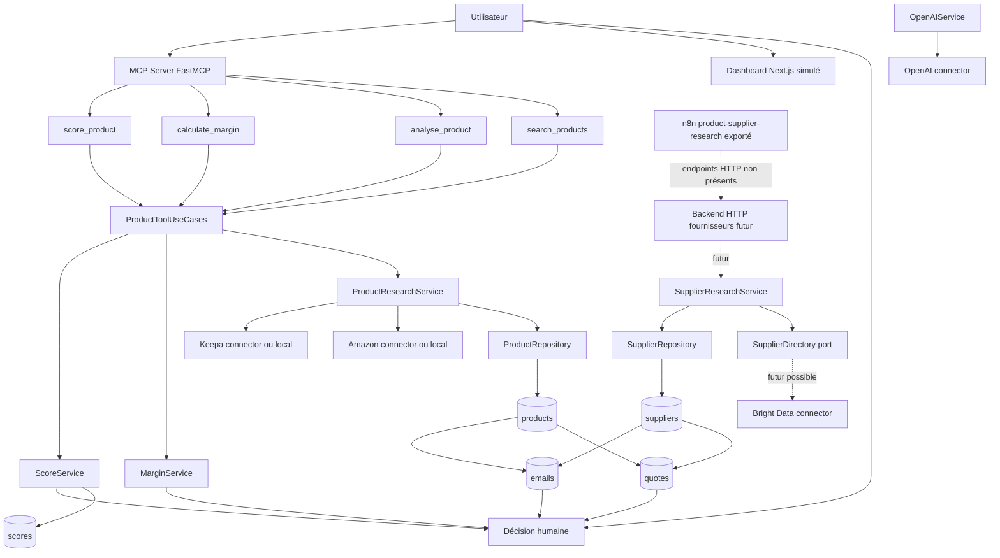
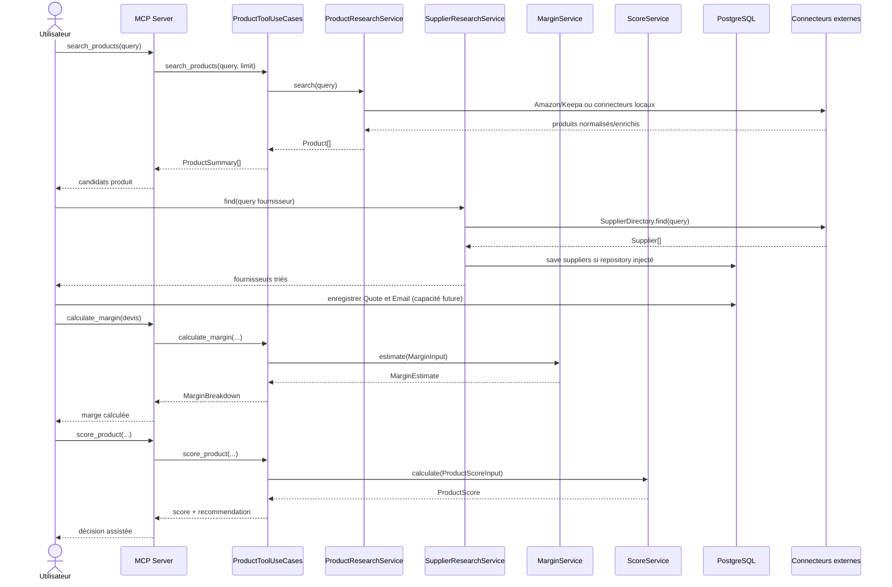
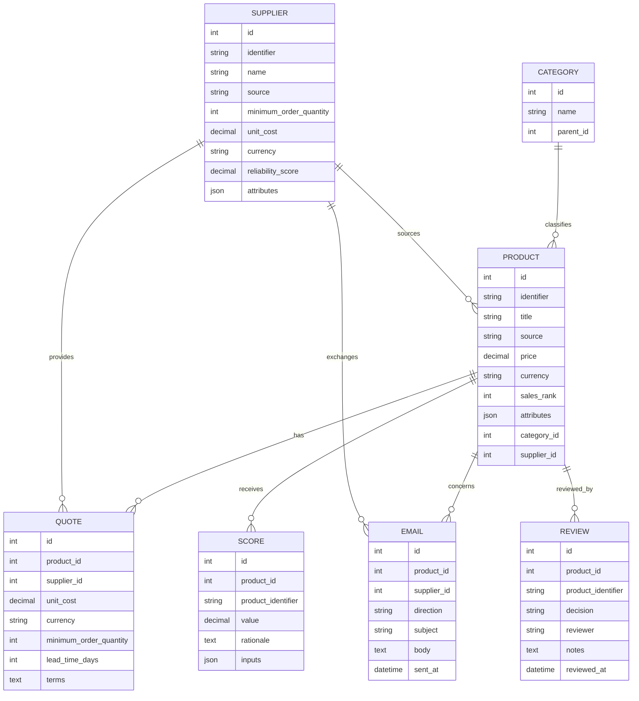

# Fonctionnalité — Négociation fournisseur

> Statut : documentation technique de cadrage basée exclusivement sur le repository existant au 2026-07-01.  
> Important : aucune fonctionnalité de négociation automatisée n'est actuellement implémentée dans le code. Le repository contient toutefois des briques de sourcing fournisseur, de devis, d'e-mails, de scoring, de marge, de connecteurs et de workflows qui définissent le périmètre réaliste d'une future négociation fournisseur.

## 1. Présentation

### But de la fonctionnalité

La fonctionnalité de négociation fournisseur vise à aider l'utilisateur Amazon FBA à préparer, suivre et exploiter une négociation commerciale avec un fournisseur pour un produit candidat. Dans l'état réel du projet, cette capacité n'existe pas comme service, tool MCP, page frontend ou workflow complet dédié. Elle doit donc être comprise comme une spécification de fonctionnalité à partir des éléments déjà présents :

- entités persistées `Supplier`, `Quote` et `Email` ;
- modèle domaine `Supplier` ;
- service `SupplierResearchService` ;
- service `MarginService` ;
- service `ScoreService` ;
- connecteurs Amazon, Keepa, Bright Data et OpenAI ;
- workflow n8n de recherche fournisseur ;
- prompts OpenAI versionnés utiles à l'analyse produit.

### Objectifs métier

Les objectifs métier sont :

1. Identifier les fournisseurs pertinents pour un produit validé ou en cours d'évaluation.
2. Comparer les conditions de sourcing disponibles : coût unitaire, minimum order quantity, délai, conditions et fiabilité.
3. Préparer une cible de négociation compatible avec la marge FBA attendue.
4. Conserver une trace exploitable des devis et e-mails échangés avec les fournisseurs.
5. Alimenter la décision humaine finale : continuer la négociation, demander plus de données, rejeter le fournisseur ou sélectionner un fournisseur.

### Utilisateurs concernés

- **Utilisateur propriétaire de la plateforme** : décide des produits FBA à sourcer et valide les fournisseurs.
- **Opérateur sourcing** : recherche des fournisseurs, collecte les devis et saisit les échanges.
- **Agent ou orchestrateur MCP futur** : pourrait demander des calculs de marge, du scoring et une synthèse de négociation via des tools MCP.
- **Workflow n8n futur** : pourrait automatiser une partie de la recherche et de la notification, mais pas négocier sans validation humaine dans l'état actuel.

### Limites actuelles

Les limites observées dans le code sont structurantes :

- aucun module `negotiation` n'existe dans `backend/src/fba_advisor/services/` ;
- aucun modèle domaine `Negotiation`, `NegotiationThread` ou `NegotiationOffer` n'existe ;
- aucun repository de négociation dédié n'existe ;
- aucun tool MCP `negotiate_supplier`, `create_quote`, `draft_supplier_email` ou équivalent n'est enregistré ;
- aucune API HTTP backend n'est implémentée ;
- le dashboard consomme une frontière MCP simulée et ne contient pas d'écran de négociation ;
- les workflows n8n référencent des endpoints fournisseurs HTTP attendus mais non présents dans le backend actuel ;
- les e-mails sont représentés en base mais aucun connecteur e-mail ou service d'envoi n'est implémenté ;
- OpenAI est disponible comme service de prompting, mais aucun prompt dédié à la négociation fournisseur n'existe.

## 2. Cas d'utilisation

### UC-01 — Rechercher des fournisseurs candidats

- **Description** : trouver des fournisseurs possibles à partir d'un nom de produit, d'un ASIN, d'une catégorie ou d'une requête libre.
- **Entrée** : chaîne `query` non vide.
- **Sortie** : liste de `Supplier` normalisés, triés par fiabilité puis coût unitaire connu.
- **Résultat attendu** : l'utilisateur obtient une liste de fournisseurs exploitables pour demander ou comparer des devis.

### UC-02 — Persister un fournisseur candidat

- **Description** : sauvegarder un fournisseur normalisé dans la base via un repository SQLAlchemy.
- **Entrée** : `Supplier` domaine avec `identifier`, `name`, `source`, et informations facultatives comme MOQ, coût, devise et fiabilité.
- **Sortie** : même `Supplier` domaine après upsert.
- **Résultat attendu** : le fournisseur est disponible pour être relié à des produits, devis et e-mails.

### UC-03 — Enregistrer un devis fournisseur

- **Description** : représenter un devis fournisseur pour un produit.
- **Entrée** : produit, fournisseur, coût unitaire, devise, MOQ, délai et conditions.
- **Sortie** : entité `Quote` persistée.
- **Résultat attendu** : le devis devient comparable avec les coûts FBA et les objectifs de marge.

> État actuel : l'entité SQLAlchemy `Quote` existe, mais aucun service applicatif ou repository dédié aux devis n'est présent.

### UC-04 — Calculer la marge cible à partir d'un devis

- **Description** : calculer la marge FBA estimée depuis prix de vente, coût rendu, frais Amazon et coût fulfillment.
- **Entrée** : `sale_price`, `landed_cost`, `amazon_fees`, `fulfillment_cost`.
- **Sortie** : `net_profit` et `margin_percent` via le tool MCP `calculate_margin` ou `MarginService`.
- **Résultat attendu** : l'utilisateur sait si un devis permet d'atteindre une marge acceptable.

### UC-05 — Scorer l'opportunité produit avant négociation

- **Description** : évaluer si le produit mérite un effort de négociation.
- **Entrée** : ASIN, ventes mensuelles estimées, nombre d'avis et marge.
- **Sortie** : score de 1 à 100, recommandation et rationale.
- **Résultat attendu** : un produit avec score insuffisant reste en watchlist ; un produit acceptable passe en investigation.

### UC-06 — Préparer un objectif de négociation

- **Description** : déduire un coût cible maximal en fonction du prix de vente, des frais, des coûts fixes et de la marge visée.
- **Entrée** : prix de vente, frais Amazon, fulfillment, marge cible et devis actuel.
- **Sortie** : coût cible, écart avec le devis, priorité de négociation.
- **Résultat attendu** : l'utilisateur dispose d'une cible chiffrée pour demander un meilleur prix ou de meilleures conditions.

> État actuel : cette logique n'existe pas comme service ; elle peut être dérivée du modèle `MarginInput` et de `MarginService`.

### UC-07 — Tracer les e-mails fournisseur

- **Description** : conserver les messages entrants ou sortants liés à un produit et un fournisseur.
- **Entrée** : fournisseur, produit, direction, sujet, corps et date d'envoi facultative.
- **Sortie** : entité `Email` persistée.
- **Résultat attendu** : l'historique de négociation est auditable.

> État actuel : l'entité SQLAlchemy `Email` existe, mais aucun service ou connecteur e-mail n'est présent.

### UC-08 — Synthétiser une négociation pour décision humaine

- **Description** : résumer devis, conditions, risques, marge et prochaine action.
- **Entrée** : produit, fournisseur, devis, e-mails, score et calculs de marge.
- **Sortie** : résumé décisionnel.
- **Résultat attendu** : l'utilisateur décide de poursuivre, relancer, accepter, rejeter ou demander plus de données.

> État actuel : OpenAIService sait exécuter des prompts versionnés, mais aucun prompt de synthèse de négociation n'existe.

## 3. Architecture

### Modules impliqués

- `backend/src/fba_advisor/domain/models.py` : modèles domaine `Supplier`, `MarginInput`, `MarginEstimate`, `ProductScoreInput` et `ProductScore`.
- `backend/src/fba_advisor/services/supplier/service.py` : recherche et tri fournisseurs.
- `backend/src/fba_advisor/services/margin/service.py` : calcul de marge.
- `backend/src/fba_advisor/services/score/service.py` : scoring d'opportunité.
- `backend/src/fba_advisor/services/openai/service.py` : exécution de prompts OpenAI versionnés.
- `backend/src/fba_advisor/models/entities.py` : entités persistées `Supplier`, `Product`, `Quote`, `Email`, `Score` et `Review`.
- `backend/src/fba_advisor/repositories/sqlalchemy.py` : persistence actuellement disponible pour fournisseurs, produits, reviews et scores.
- `mcp-server/src/fba_mcp_server/tools/` : tools MCP existants, sans tool de négociation dédié.
- `workflows/n8n/product-supplier-research.json` : workflow exporté de recherche fournisseur, dépendant d'endpoints HTTP non implémentés.

### Services

- `SupplierResearchService` : recherche et tri des fournisseurs.
- `MarginService` : estimation financière.
- `ScoreService` : évaluation d'opportunité.
- `OpenAIService` : analyse IA via prompts existants, utilisable pour une synthèse future mais non spécialisé négociation.
- `ProductResearchService` et `ProductToolUseCases` : fournissent les informations produit et tools MCP existants.

### Outils MCP

Outils MCP réellement enregistrés :

- `search_products`
- `analyse_product`
- `calculate_margin`
- `score_product`

Aucun outil MCP de négociation fournisseur n'est présent.

### Connecteurs

- Amazon : recherche produit.
- Keepa : enrichissement analytique produit.
- Bright Data : connecteur présent, potentiellement adapté au scraping/recherche fournisseur, mais non câblé dans `SupplierResearchService` dans l'état actuel.
- OpenAI : analyse textuelle via prompts versionnés.

### Base de données

PostgreSQL est la base cible. Les entités utiles à la négociation sont `suppliers`, `products`, `quotes`, `emails`, `scores` et éventuellement `reviews`.

### Dépendances

- Python, SQLAlchemy, Alembic, Pydantic, FastMCP, pydantic-settings.
- Next.js côté dashboard, mais sans écran négociation.
- PostgreSQL via Docker Compose.
- APIs externes potentielles via connecteurs.

### Diagramme Mermaid



## 4. Flux d'exécution

### Flux complet attendu avec les composants existants

1. L'utilisateur sélectionne ou recherche un produit candidat.
2. Le serveur MCP peut rechercher, analyser, calculer une marge et scorer le produit via les tools existants.
3. Une recherche fournisseur est lancée via `SupplierResearchService` si un `SupplierDirectory` concret est fourni.
4. Les fournisseurs sont normalisés, optionnellement persistés, puis triés.
5. L'utilisateur ou une future couche applicative collecte un devis fournisseur.
6. Le devis est enregistré dans `quotes` si un service/repository futur l'implémente.
7. Le coût du devis sert d'entrée à `MarginService` ou au tool `calculate_margin`.
8. Le score produit est mis à jour ou consulté via `ScoreService` ou `score_product`.
9. Les e-mails de négociation sont conservés dans `emails` si un service futur les expose.
10. L'utilisateur prend la décision finale.

### Diagramme Mermaid



## 5. Outils MCP utilisés

### `search_products`

- **Rôle** : rechercher des produits candidats avant négociation fournisseur.
- **Paramètres** : `query`, `marketplace`, `limit`.
- **Retour** : liste de `ProductSummary` avec ASIN, titre, marketplace, prix, devise, ventes estimées, avis, rating et URL produit.
- **Dépendances** : `BackendProductResearchService`, `ProductToolUseCases`, `ProductResearchService`, adaptateurs Amazon et Keepa locaux dans la factory MCP actuelle.

### `analyse_product`

- **Rôle** : produire un diagnostic synthétique du produit avant d'investir du temps dans la négociation.
- **Paramètres** : `asin`, `marketplace`.
- **Retour** : `ProductAnalysis` avec niveau de demande, niveau de concurrence, niveau de risque, opportunités et avertissements.
- **Dépendances** : `ProductToolUseCases.analyse_product`, recherche produit existante, signaux simples de rang et avis.

### `calculate_margin`

- **Rôle** : vérifier si un devis fournisseur permet une marge FBA acceptable.
- **Paramètres** : `sale_price`, `landed_cost`, `amazon_fees`, `fulfillment_cost`.
- **Retour** : `MarginBreakdown` avec prix, coût rendu, frais, fulfillment, profit net et pourcentage de marge.
- **Dépendances** : `MarginService`, modèle domaine `MarginInput`, validation Pydantic `CalculateMarginRequest`.

### `score_product`

- **Rôle** : décider si un produit justifie une négociation fournisseur.
- **Paramètres** : `asin`, `monthly_sales_estimate`, `review_count`, `margin_percent`.
- **Retour** : `ProductScore` avec score, recommandation et justification.
- **Dépendances** : `ScoreService.calculate`, `ProductScoreInput`, repository de score facultatif.

### Outils absents

Les outils suivants n'existent pas et ne doivent pas être considérés comme disponibles :

- `search_suppliers` MCP ;
- `create_quote` MCP ;
- `draft_negotiation_email` MCP ;
- `send_supplier_email` MCP ;
- `summarize_negotiation` MCP.

## 6. Services impliqués

### `SupplierResearchService`

- **Responsabilités** : normaliser la requête, appeler un `SupplierDirectory`, persister les fournisseurs si un `SupplierRepository` est injecté, trier les résultats.
- **Dépendances** : `SupplierDirectory`, `SupplierRepository` facultatif.
- **Règle métier actuelle** : tri par présence de fiabilité, fiabilité décroissante, présence de coût unitaire, coût unitaire croissant.

### `MarginService`

- **Responsabilités** : calculer revenu, coût total, profit, taux de marge et frais referral.
- **Dépendances** : aucune dépendance externe.
- **Règles actuelles** : prix de vente strictement positif, coûts non négatifs, taux referral entre 0 et 1.

### `ScoreService`

- **Responsabilités** : calculer un score d'opportunité produit, avec chemin legacy simple et moteur configurable plus riche.
- **Dépendances** : `ScoreRepository` facultatif, configuration YAML facultative.
- **Règles actuelles** : normalisation entre 0 et 1, scoring sur 100, rationale faible/modérée/forte.

### `ProductResearchService`

- **Responsabilités** : rechercher des produits via un `ProductCatalog`, enrichir via `ProductAnalytics`, persister via `ProductRepository` facultatif.
- **Dépendances** : ports catalog/analytics/repository.

### `OpenAIService`

- **Responsabilités** : charger des prompts versionnés et appeler un connecteur OpenAI.
- **Dépendances** : `OpenAIConnector`, `PromptRepository`.
- **Limite** : aucun prompt de négociation fournisseur n'est présent.

## 7. Connecteurs

### Amazon

Utilisé pour la découverte produit via `AmazonProductCatalog`. Il aide à connaître prix, titre, ASIN et données brutes utiles avant sourcing.

### Keepa

Utilisé pour enrichir les produits avec des signaux de marché, notamment le sales rank et les données brutes d'analyse.

### Bright Data

Présent comme connecteur provider isolé. Il n'est pas actuellement branché sur `SupplierResearchService`, mais c'est le candidat naturel pour alimenter un futur `SupplierDirectory` si le scraping ou l'accès à des sources web fournisseurs est nécessaire.

### OpenAI

Utilisé par `OpenAIService` pour exécuter des prompts versionnés. Dans une négociation future, il pourrait synthétiser les conditions, rédiger des brouillons d'e-mails ou analyser des risques, mais ces prompts ne sont pas présents aujourd'hui.

### Connecteur e-mail

Aucun connecteur e-mail n'existe. Les e-mails sont seulement modélisés en base.

## 8. Modèle de données

### Entités concernées

- **Product** : produit candidat FBA, relié à catégorie, fournisseur, reviews, scores, quotes et emails.
- **Supplier** : fournisseur, avec identifiant source, nom, MOQ, coût unitaire, devise, score de fiabilité et attributs JSON.
- **Quote** : devis fournisseur pour un produit, avec coût unitaire, devise, MOQ, délai et conditions.
- **Email** : message entrant ou sortant lié à un fournisseur et/ou produit.
- **Score** : score d'opportunité produit.
- **Review** : décision humaine sur un produit.
- **Category** : classification produit.

### Relations

- Un `Supplier` peut être associé à plusieurs `Product`.
- Un `Product` peut avoir plusieurs `Quote`.
- Un `Supplier` peut avoir plusieurs `Quote`.
- Un `Product` et un `Supplier` peuvent avoir plusieurs `Email`.
- Un `Product` peut avoir plusieurs `Score` et `Review`.

### Diagramme Mermaid



## 9. Algorithme

### Algorithme réalisable avec les services actuels

1. Recevoir un produit candidat ou une requête produit.
2. Rechercher/analyser le produit via les tools MCP existants.
3. Récupérer ou estimer les signaux suivants : prix de vente, ventes mensuelles, nombre d'avis, coût fournisseur ou coût rendu.
4. Rechercher les fournisseurs via `SupplierResearchService.find(query)`.
5. Écarter les fournisseurs sans données minimales si la décision exige MOQ, coût ou fiabilité.
6. Trier les fournisseurs selon la règle actuelle :
   1. fournisseurs avec fiabilité connue avant fiabilité inconnue ;
   2. fiabilité décroissante ;
   3. fournisseurs avec coût connu avant coût inconnu ;
   4. coût unitaire croissant.
7. Pour chaque devis ou coût connu :
   1. calculer la marge avec `MarginService` ;
   2. comparer la marge au seuil cible du projet ;
   3. calculer l'écart entre coût actuel et coût cible.
8. Scorer le produit avec `ScoreService` ou `score_product`.
9. Produire une recommandation humaine :
   - négocier si score produit acceptable mais marge insuffisante ;
   - accepter la piste si marge et fiabilité sont suffisantes ;
   - demander plus de données si coût, MOQ, délai ou fiabilité manquent ;
   - rejeter si score et marge sont faibles.
10. Journaliser et persister les informations disponibles.

### Pseudo-code

```text
entrée: product_query, supplier_query, sale_price, amazon_fees, fulfillment_cost, target_margin

products = rechercher produits(product_query)
product = sélectionner produit candidat
analysis = analyser produit(product.identifier)

suppliers = rechercher fournisseurs(supplier_query)
si suppliers est vide:
    retourner décision: needs_more_data

pour chaque supplier dans suppliers:
    quote = devis connu ou données supplier
    si quote.unit_cost est absent:
        marquer supplier comme needs_quote
        continuer

    margin = calculer marge(
        sale_price,
        landed_cost = quote.unit_cost,
        amazon_fees,
        fulfillment_cost
    )

    score = scorer produit(product, margin.margin_percent)
    cost_target = sale_price - amazon_fees - fulfillment_cost - profit_cible(target_margin)
    negotiation_gap = quote.unit_cost - cost_target

    classer supplier selon:
        score produit
        marge
        reliability_score
        negotiation_gap
        MOQ
        délai

retourner fournisseurs classés, cible de négociation et prochaine action humaine
```

## 10. Configuration

### Variables d'environnement

Variables réellement présentes ou supportées :

- `APP_ENV` : environnement applicatif.
- `LOG_LEVEL` : niveau de logs backend/MCP.
- `DATABASE_URL` : URL SQLAlchemy/PostgreSQL.
- `POSTGRES_DB`, `POSTGRES_USER`, `POSTGRES_PASSWORD`, `POSTGRES_HOST`, `POSTGRES_PORT` : configuration PostgreSQL Docker.
- `BACKEND_BASE_URL` : disponible dans la configuration MCP, mais non utilisé par les tools actuels.
- `MCP_SERVER_NAME` : nom du serveur MCP.

### Paramètres

- Prix de vente.
- Coût produit ou coût rendu.
- Frais Amazon.
- Coût fulfillment.
- Taux referral.
- MOQ.
- Délai fournisseur.
- Score de fiabilité fournisseur.
- Marge cible.

### Pondérations

Le fichier `backend/src/fba_advisor/services/score/config.yaml` définit les pondérations du scoring riche :

- concurrence : `0.20`
- marge : `0.25`
- brandabilité : `0.15`
- différenciation : `0.15`
- tendance : `0.15`
- saisonnalité : `0.10`

Il définit aussi les références de normalisation :

- `target_margin_rate: 0.30`
- `max_competing_offers: 50`
- `max_review_count: 1000`
- `max_sales_rank: 100000`
- `trend_growth_reference: 0.30`
- `seasonality_volatility_reference: 0.50`

### Fichiers de configuration

- `.env.example`
- `docker-compose.yml`
- `alembic.ini`
- `backend/src/fba_advisor/services/score/config.yaml`
- `mcp-server/src/fba_mcp_server/config.py`
- `backend/src/fba_advisor/config.py`

## 11. Gestion des erreurs

| Erreur possible | Comportement attendu | Stratégie de reprise |
|---|---|---|
| Requête fournisseur vide | Retourner une liste vide | Demander une requête plus précise |
| Aucun fournisseur trouvé | Décision `needs_more_data` | Relancer avec autres mots-clés ou autre source |
| Prix de vente nul ou négatif | `MarginService` lève une erreur | Corriger l'entrée avant calcul |
| Coûts négatifs | `MarginService` lève une erreur | Refuser les données invalides |
| Taux referral hors `[0,1]` | `MarginService` lève une erreur | Recalculer les frais Amazon |
| ASIN invalide côté MCP | `_safe_tool` retourne `validation_error` | Corriger la longueur/valeur ASIN |
| Tool MCP en exception | `_safe_tool` retourne `tool_execution_error` | Inspecter logs et rejouer après correction |
| Données devis incomplètes | Marquer fournisseur `needs_quote` | Demander devis complet au fournisseur |
| Absence de connecteur e-mail | Ne pas tenter d'envoi automatique | Stocker brouillon ou utiliser un canal manuel |
| Erreur provider externe | Lever exception provider contrôlée | Retry avec backoff futur ou fallback manuel |
| Échec de persistance | Transaction à annuler | Corriger session/DB puis rejouer l'upsert |

## 12. Logging

### Ce qui doit être journalisé

- Début et fin de recherche produit.
- Nombre de produits ou fournisseurs retournés.
- Calcul de marge demandé, sans exposer de données sensibles inutiles.
- Score produit calculé.
- Validation échouée d'un tool MCP.
- Exception provider ou tool MCP.
- Persistance de fournisseurs, devis et e-mails lorsqu'un service dédié sera ajouté.
- Décision humaine finale ou statut de négociation.

### Niveaux de logs

- `INFO` : opération terminée, nombre d'éléments, serveur MCP configuré.
- `WARNING` : validation d'entrée échouée, données devis incomplètes, fournisseur sans information critique.
- `ERROR` / exception : échec tool MCP, échec provider, échec persistance.
- `DEBUG` : détails de mapping ou payloads non sensibles en environnement local uniquement.

### Événements importants

- `product.search.completed` existe déjà dans la façade applicative.
- `product.analyse`, `product.margin` et `product.score` peuvent être tracés via le port `Tracer`.
- Un futur service devrait ajouter des événements comme `supplier.search.completed`, `quote.created`, `negotiation.email.recorded`, `negotiation.decision.updated`.

## 13. Tests

### Tests unitaires

- `SupplierResearchService.find` : requête vide, tri par fiabilité, tri par coût, persistance facultative.
- `MarginService.estimate` : calcul nominal, prix invalide, coûts négatifs, taux referral invalide.
- `ScoreService.calculate` : score faible/modéré/fort, bornage des entrées, repository facultatif.
- Futur `NegotiationService` : coût cible, écart de négociation, recommandation.

### Tests d'intégration

- Repositories SQLAlchemy pour `Supplier`, `Quote` et `Email`.
- Tool MCP `calculate_margin` avec entrées Decimal valides.
- Tool MCP `score_product` avec score et recommandation attendus.
- Workflow futur de bout en bout : produit → fournisseur → devis → marge → décision.

### Cas limites

- Fournisseur sans coût.
- Fournisseur sans fiabilité.
- MOQ très élevé.
- Marge négative.
- Frais Amazon supérieurs au prix de vente.
- Produit sans sales rank.
- Multiples devis pour un même fournisseur et produit.
- E-mails sans `sent_at`.
- Score produit faible malgré marge élevée.

### Données de test

- Produit Amazon simulé avec ASIN de 10 caractères.
- Fournisseur fiable avec coût connu.
- Fournisseur peu fiable avec coût bas.
- Devis avec MOQ élevé.
- Devis compatible avec `target_margin_rate` de 30 %.
- Historique d'e-mails entrant/sortant.

### Checklist

- [ ] Recherche fournisseur retourne une liste vide pour requête blanche.
- [ ] Recherche fournisseur trie correctement par fiabilité décroissante.
- [ ] Recherche fournisseur trie correctement par coût croissant à fiabilité équivalente.
- [ ] Fournisseur persisté respecte l'unicité `(source, identifier)`.
- [ ] Devis persisté relie produit et fournisseur.
- [ ] E-mail persisté relie produit et fournisseur.
- [ ] Marge positive calculée correctement.
- [ ] Marge négative calculée sans masquer le risque.
- [ ] Score produit retourne une recommandation cohérente.
- [ ] Entrées MCP invalides retournent une erreur contrôlée.
- [ ] Aucun secret provider n'apparaît dans les logs.

## 14. Performance

### Points sensibles

- Appels fournisseurs externes potentiellement lents.
- Enrichissement produit via Keepa pour plusieurs candidats.
- Analyse IA OpenAI si elle est utilisée pour synthétiser les négociations.
- Persistance répétée de fournisseurs et produits avec upsert par requête individuelle.
- Workflows n8n pouvant enchaîner plusieurs appels HTTP.

### Optimisations possibles

- Cache par `source + identifier` pour fournisseurs et produits.
- Cache court terme des résultats de recherche fournisseur.
- Batch upsert pour listes de fournisseurs.
- Limitation stricte du nombre de fournisseurs analysés par produit.
- Recalcul de marge local sans appel externe.
- Exécution asynchrone future pour enrichissements provider.

### Cache éventuel

Aucun cache applicatif n'est implémenté. Un futur cache devrait distinguer :

- données provider brutes ;
- données normalisées ;
- analyses IA ;
- devis et e-mails, qui doivent rester persistés et auditables plutôt que simplement cachés.

## 15. Sécurité

### Validations

- Valider les montants comme non négatifs.
- Valider prix de vente strictement positif.
- Valider devis et devises.
- Valider directions d'e-mail (`inbound` / `outbound` ou équivalent futur).
- Valider les ASIN sur 10 caractères côté MCP.
- Ne jamais faire confiance aux attributs JSON provider sans mapping explicite.

### Secrets

- Les secrets doivent rester dans les variables d'environnement.
- `.env.example` ne contient que des valeurs de développement.
- Aucun secret ne doit être écrit dans `Quote.terms`, `Email.body`, logs ou attributs JSON.

### Permissions

- Le projet ne contient pas encore d'authentification applicative.
- Une fonctionnalité de négociation réelle devrait être réservée à l'utilisateur propriétaire ou à des opérateurs autorisés.
- L'envoi d'e-mails automatiques, s'il est ajouté, doit exiger validation humaine ou garde-fou explicite.

### Données sensibles

- Conditions commerciales fournisseur.
- Corps d'e-mails.
- Prix négociés.
- Informations de contact fournisseur.
- Clés API provider.

## 16. Dépendances

### Dépendances internes

- `fba_advisor.domain.models`
- `fba_advisor.services.supplier`
- `fba_advisor.services.margin`
- `fba_advisor.services.score`
- `fba_advisor.services.product`
- `fba_advisor.services.openai`
- `fba_advisor.ports.catalog`
- `fba_advisor.ports.repositories`
- `fba_advisor.repositories.sqlalchemy`
- `fba_advisor.models.entities`
- `fba_mcp_server.tools`
- `fba_mcp_server.schemas`
- `workflows/n8n/product-supplier-research.json`

### Dépendances externes

- PostgreSQL.
- SQLAlchemy.
- Alembic.
- Pydantic.
- FastMCP / MCP SDK.
- Amazon provider.
- Keepa provider.
- Bright Data provider.
- OpenAI provider.
- n8n comme orchestrateur externe exporté, non lancé par `docker-compose.yml`.

## 17. Roadmap

### Version actuelle

- Pas de fonctionnalité négociation dédiée.
- Recherche fournisseur disponible comme service backend si un `SupplierDirectory` est injecté.
- Entités `Supplier`, `Quote` et `Email` présentes en base.
- Calcul de marge et scoring disponibles.
- Workflow n8n fournisseur exporté mais dépendant d'endpoints HTTP absents.

### V2

- Ajouter un modèle domaine `Quote` et éventuellement `Negotiation`.
- Ajouter repositories ports/adapters pour `Quote` et `Email`.
- Ajouter `NegotiationService` ou `SupplierNegotiationService`.
- Ajouter un tool MCP `search_suppliers` si la capacité doit être agentique.
- Ajouter un prompt OpenAI versionné pour synthèse de négociation, sans envoi automatique.
- Ajouter tests unitaires et d'intégration.

### V3

- Ajouter dashboard de négociation.
- Ajouter transport dashboard vers MCP réel ou API HTTP backend.
- Ajouter connecteur e-mail avec brouillons et validation humaine.
- Ajouter historique de négociation et comparaison multi-devis.
- Ajouter règles de risque fournisseur par marketplace/catégorie.

### Améliorations futures

- Score fournisseur composite.
- Optimisation multi-objectifs : marge, MOQ, délai, fiabilité, risque pays/source.
- Détection d'anomalies dans les devis.
- Rappels automatiques de relance.
- Templates de messages versionnés.
- Audit trail complet des décisions humaines.

## 18. Dette technique

### P0

- Les endpoints HTTP fournisseurs référencés par le workflow n8n ne sont pas implémentés.
- Aucun service ou repository dédié aux devis et e-mails malgré la présence des entités SQLAlchemy.
- Aucun tool MCP de sourcing fournisseur ou négociation n'est exposé.

### P1

- `SupplierResearchService` dépend d'un `SupplierDirectory`, mais aucune implémentation concrète de supplier directory n'est visible.
- Bright Data est présent comme connecteur mais non intégré au sourcing fournisseur.
- Aucun prompt OpenAI de négociation fournisseur n'existe.
- Aucune UI de négociation dans le dashboard.
- Pas d'authentification/autorisation applicative.

### P2

- Pas de cache provider.
- Pas de score fournisseur riche au-delà de `reliability_score`.
- Pas de configuration dédiée aux seuils de négociation.
- Pas de statut de négociation persistant.
- Pas de typage domaine pour devis/e-mail, seulement SQLAlchemy.

## 19. ADR liées

- **ADR-001 — Monorepo applicatif privé** : la négociation doit coordonner backend, MCP, workflows, DB et documentation dans le même repository.
- **ADR-002 — Clean Architecture** : toute logique de négociation doit vivre dans domaine/services/use cases, pas dans MCP, frontend ou connecteurs.
- **ADR-003 — Backend importable** : la négociation doit d'abord être une capacité du package `fba_advisor`, pas une API HTTP isolée.
- **ADR-004 — MCP FastMCP comme interface agentique** : les capacités agentiques de négociation doivent être exposées via des tools fins qui délèguent au backend.
- **ADR-005 — Connecteurs isolés** : Amazon, Keepa, Bright Data, OpenAI et un futur e-mail provider doivent rester derrière interfaces et mappers.
- **ADR-006 et suivants du registre** : toute décision existante sur persistance, dashboard simulé, workflows n8n et prompts versionnés doit être respectée lors de l'implémentation.

## 20. Impact sur le reste du projet

### Modules impactés

Une implémentation future toucherait probablement :

- `backend/src/fba_advisor/domain/models.py` pour ajouter devis/négociation domaine.
- `backend/src/fba_advisor/ports/repositories.py` pour ajouter repositories de devis/e-mails/négociation.
- `backend/src/fba_advisor/services/` pour ajouter un service de négociation.
- `backend/src/fba_advisor/repositories/sqlalchemy.py` pour persister devis et e-mails via ports.
- `mcp-server/src/fba_mcp_server/tools/` pour exposer des tools dédiés.
- `mcp-server/src/fba_mcp_server/schemas/` pour les contrats MCP.
- `frontend/src/` pour un écran dashboard futur.
- `workflows/n8n/` pour aligner les workflows sur les capacités réelles.
- `prompts/` pour ajouter des prompts de synthèse/rédaction négociation.
- `docs/ADR.md` si une décision structurante est prise.

### Risques

- Dupliquer la logique entre workflow n8n, MCP et backend.
- Envoyer des e-mails sans validation humaine.
- Mélanger entités SQLAlchemy et modèles domaine.
- Faire dépendre le service métier directement d'un provider.
- Exposer des conditions commerciales ou secrets dans les logs.
- Documenter des capacités comme existantes alors qu'elles ne sont que prévues.

### Compatibilité

- La fonctionnalité doit préserver les contracts MCP existants.
- Les entités actuelles `Supplier`, `Quote` et `Email` peuvent servir de base sans casser la migration existante.
- Une API HTTP future doit être un adaptateur, pas une source de règles métier.
- Le dashboard actuel étant simulé, toute intégration réelle doit conserver une frontière client explicite.
