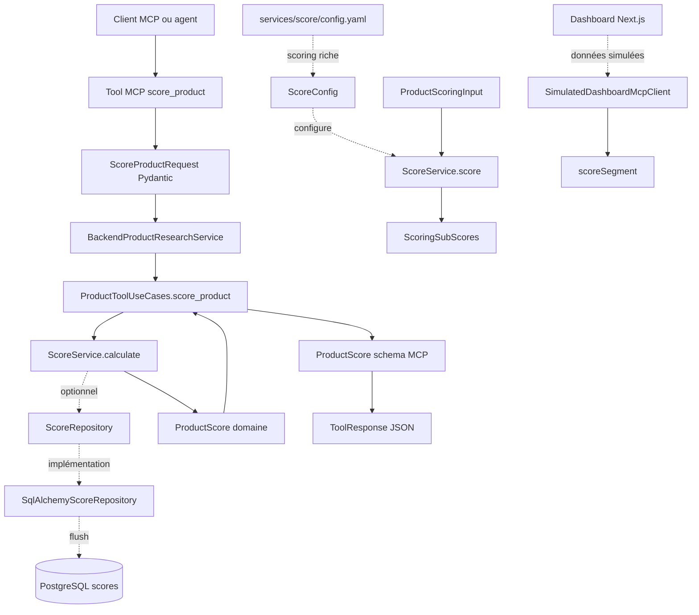
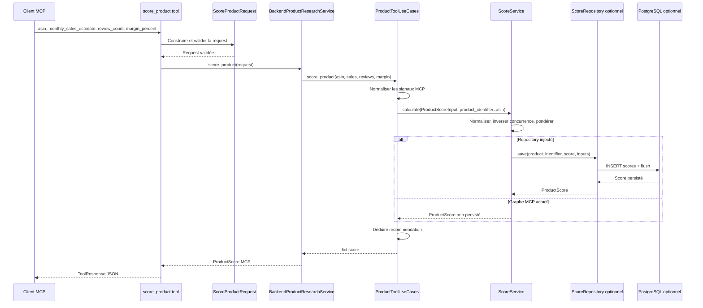
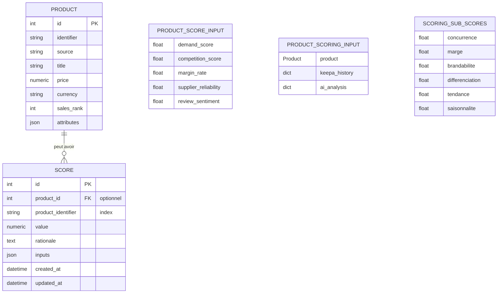

# Scoring Engine

> Statut : spécification fonctionnelle et technique basée uniquement sur le code présent au 2026-07-01.
>
> Périmètre : moteur de scoring produit backend, exposition MCP `score_product`, persistance optionnelle des scores et affichage dashboard simulé. Aucun comportement décrit ici ne suppose une API HTTP backend publique, une intégration fournisseur réelle dans le graphe MCP, ni un transport dashboard → MCP réel.

## 1. Présentation

### But de la fonctionnalité

Le Scoring Engine attribue un score d'opportunité à un produit candidat Amazon FBA afin d'aider l'utilisateur à prioriser les analyses, comparer les idées produit et décider si une opportunité doit être investiguée, surveillée ou écartée.

La fonctionnalité existe sous deux formes dans le backend :

1. **Scoring legacy exposé par MCP** : `ScoreService.calculate()` consomme des critères déjà normalisés (`demand_score`, `competition_score`, `margin_rate`, `supplier_reliability`, `review_sentiment`) et retourne un score global sur 100 avec une justification textuelle.
2. **Scoring riche configurable** : `ScoreService.score()` consomme un `ProductScoringInput` incluant un produit normalisé, un historique Keepa et une analyse IA, calcule des sous-scores métier, applique des pondérations configurables et retourne un score global, des sous-scores et une explication détaillée.

Le tool MCP actuellement enregistré et utilisé par les tests est `score_product`. Il utilise le scoring legacy via le use case `ProductToolUseCases.score_product()`.

### Objectifs métier

- Prioriser les opportunités produit FBA avec une métrique simple et comparable.
- Combiner des signaux de demande, concurrence, marge, fournisseur et sentiment client dans un score synthétique.
- Préparer un scoring plus explicable via des sous-scores : concurrence, marge, brandabilité, différenciation, tendance et saisonnalité.
- Alimenter des décisions humaines plutôt que déclencher automatiquement des achats d'inventaire.
- Préserver la capacité de simulation locale pour travailler sans credentials fournisseurs.

### Utilisateurs concernés

- **Utilisateur métier / opérateur FBA** : consulte les scores pour sélectionner les produits à analyser.
- **Agent ou client MCP** : appelle `score_product` avec des paramètres validés.
- **Développeur backend** : maintient `ScoreService`, les modèles domaine, les repositories et les tests.
- **Développeur MCP** : maintient le tool `score_product`, ses schemas Pydantic et l'adaptateur MCP.
- **Développeur frontend** : consomme actuellement des scores simulés via le dashboard et segmente les produits côté UI.

### Limites actuelles

- Le tool MCP `score_product` n'utilise pas encore le scoring riche configurable ; il appelle `ScoreService.calculate()`.
- Les poids legacy sont codés en dur dans `ScoreService.calculate()` et distincts de `services/score/config.yaml`.
- Le graphe MCP construit par `get_product_research_service()` injecte `ScoreService()` sans repository ; les scores MCP ne sont donc pas persistés.
- Le dashboard Next.js utilise `SimulatedDashboardMcpClient` et des données de score statiques ; il ne consomme pas le tool MCP réel.
- Aucune API HTTP backend publique n'est présente dans le repository, même si des workflows n8n référencent des URLs HTTP.
- Le scoring riche accepte des dictionnaires `keepa_history` et `ai_analysis`, mais aucun orchestrateur actuel ne les alimente automatiquement depuis les connecteurs réels pour `score_product`.
- Le parsing YAML du scoring est volontairement minimal et limité au sous-ensemble utilisé par `config.yaml`.

## 2. Cas d'utilisation

### UC1 — Scorer un produit via le tool MCP `score_product`

- **Description** : un client MCP demande un score décisionnel à partir d'un ASIN, d'une estimation de ventes mensuelles, d'un nombre de reviews et d'une marge en pourcentage.
- **Entrée** :
  - `asin` : chaîne de longueur 10.
  - `monthly_sales_estimate` : entier positif ou nul.
  - `review_count` : entier positif ou nul.
  - `margin_percent` : `Decimal` respectant les contraintes Pydantic `max_digits=5`, `decimal_places=2`.
- **Sortie** : enveloppe `ToolResponse` contenant un `ProductScore` MCP avec `asin`, `score`, `recommendation` et `rationale`.
- **Résultat attendu** : le score est compris entre 1 et 100 côté réponse MCP, la recommandation vaut `investigate` si le score calculé est supérieur ou égal à 60, sinon `watchlist`.

### UC2 — Calculer un score legacy depuis le backend

- **Description** : un service applicatif ou un test appelle directement `ScoreService.calculate()` avec des critères normalisés.
- **Entrée** : `ProductScoreInput` avec `demand_score`, `competition_score`, `margin_rate`, `supplier_reliability` et `review_sentiment`.
- **Sortie** : `ProductScore` domaine avec `value` et `rationale`.
- **Résultat attendu** : les valeurs sont bornées entre 0 et 1 avant pondération, la concurrence est inversée, puis le score est arrondi à deux décimales sur 100.

### UC3 — Persister un score legacy

- **Description** : le backend calcule un score legacy et le sauvegarde si un `ScoreRepository` et un `product_identifier` sont fournis.
- **Entrée** : `ProductScoreInput`, `product_identifier` et repository injecté.
- **Sortie** : `ProductScore` retourné par le repository.
- **Résultat attendu** : une ligne `scores` est créée avec `product_identifier`, `value`, `rationale` et les inputs utilisés.

### UC4 — Calculer un score riche configurable

- **Description** : le backend évalue une opportunité avec un produit normalisé, des signaux Keepa et des signaux IA.
- **Entrée** : `ProductScoringInput(product, keepa_history, ai_analysis)`.
- **Sortie** : `ProductScore` avec `value`, `rationale`, `sub_scores` et `explanation`.
- **Résultat attendu** : les six sous-scores sont calculés sur 100, pondérés par `ScoreWeights`, puis combinés en score global arrondi à deux décimales.

### UC5 — Charger une politique de scoring depuis YAML

- **Description** : un composant backend construit `ScoreService(config_path=...)` pour appliquer des poids et seuils externes.
- **Entrée** : chemin vers un fichier YAML compatible avec le parser interne.
- **Sortie** : instance `ScoreService` configurée.
- **Résultat attendu** : les clés connues sont converties en nombres, les clés inconnues de poids sont ignorées et les valeurs absentes conservent les defaults.

### UC6 — Segmenter un score dans le dashboard simulé

- **Description** : le dashboard affiche un segment lisible pour un score produit simulé.
- **Entrée** : `DashboardProduct` ou objet contenant `score`.
- **Sortie** : `opportunité`, `surveillance` ou `risque`.
- **Résultat attendu** : score `>= 80` → `opportunité`, score `>= 60` → `surveillance`, sinon `risque`.

### UC7 — Orchestration n8n exportée

- **Description** : le workflow `daily-amazon-research.json` contient une étape HTTP de scoring produit.
- **Entrée** : URL issue de `MCP_HTTP_URL` ou valeur par défaut `http://mcp-server:8000/tools/score_product`.
- **Sortie** : réponse HTTP attendue par le workflow.
- **Résultat attendu** : le workflow décrit l'intention d'orchestration, mais il n'est pas source de vérité métier et aucun service n8n n'est déclaré dans `docker-compose.yml`.

## 3. Architecture

### Modules impliqués

- `backend/src/fba_advisor/domain/models.py` : modèles domaine `ProductScoreInput`, `ProductScoringInput`, `ScoringSubScores`, `ProductScore`.
- `backend/src/fba_advisor/services/score/service.py` : moteur de scoring, configuration, pondérations et parser YAML minimal.
- `backend/src/fba_advisor/services/score/config.yaml` : configuration du scoring riche.
- `backend/src/fba_advisor/application/product_tools.py` : use case MCP `score_product` qui normalise les entrées MCP et délègue au service de score.
- `backend/src/fba_advisor/ports/repositories.py` : port `ScoreRepository` utilisé pour la persistance optionnelle.
- `backend/src/fba_advisor/repositories/sqlalchemy.py` : `SqlAlchemyScoreRepository`.
- `backend/src/fba_advisor/models/entities.py` : entité ORM `Score` et relation avec `Product`.
- `mcp-server/src/fba_mcp_server/tools/score_product.py` : tool MCP exposé.
- `mcp-server/src/fba_mcp_server/schemas/requests.py` : validation `ScoreProductRequest`.
- `mcp-server/src/fba_mcp_server/schemas/products.py` : schema réponse MCP `ProductScore`.
- `mcp-server/src/fba_mcp_server/services/product_research.py` : adaptateur MCP vers use cases backend.
- `mcp-server/src/fba_mcp_server/tools/dependencies.py` : factory du graphe local MCP.
- `frontend/src/features/score/score.ts` : segmentation UI de scores dashboard simulés.
- `frontend/src/lib/mcp/client.ts` : client dashboard simulé contenant des scores statiques.
- `workflows/n8n/daily-amazon-research.json` : orchestration exportée qui appelle une URL de scoring.

### Services

- `ScoreService` : calcul du score legacy et du score riche configurable.
- `ProductToolUseCases` : orchestration applicative utilisée par MCP.
- `BackendProductResearchService` : adaptateur entre schemas MCP et use cases backend.
- `LoggingTracer` : tracing applicatif injecté dans le graphe MCP.

### Outils MCP

- `score_product` est le seul tool MCP dédié au scoring.
- Le serveur MCP enregistre aussi `search_products`, `analyse_product` et `calculate_margin`, qui peuvent précéder le scoring dans un flux produit mais ne calculent pas le score.

### Connecteurs

Le scoring legacy exposé par `score_product` ne contacte pas directement de connecteur fournisseur. Dans le graphe MCP local, les connecteurs locaux Amazon et Keepa sont présents pour le service de recherche produit, mais ils ne sont pas appelés par `ProductToolUseCases.score_product()`.

Le scoring riche peut consommer des données issues de Keepa ou d'une analyse IA, mais il reçoit ces données sous forme de dictionnaires déjà fournis ; il ne dépend pas directement de `KeepaConnector` ni de `OpenAIConnector`.

### Base de données

- Table concernée : `scores`.
- Relation : `Score.product_id` référence optionnellement `products.id` ; `Score.product_identifier` permet d'indexer par identifiant produit même sans relation ORM renseignée.
- Persistance actuelle : uniquement si `ScoreService` reçoit un repository et si `calculate()` est appelé avec `product_identifier`.

### Dépendances

- Python : dataclasses, `Decimal`, `Path`, collections abstraites.
- Pydantic : schemas MCP et validation des paramètres.
- SQLAlchemy : persistance optionnelle via repository.
- FastMCP : exposition du tool par le serveur MCP.
- Frontend : TypeScript/Next.js pour l'affichage simulé, sans appel direct au backend.

### Diagramme Mermaid



## 4. Flux d'exécution

### Flux MCP actuel

1. Le client appelle `score_product(asin, monthly_sales_estimate, review_count, margin_percent)`.
2. Le tool construit `ScoreProductRequest`.
3. Pydantic valide les contraintes de type, longueur d'ASIN, entiers non négatifs et format décimal.
4. Le tool journalise l'événement `Scoring product` avec l'ASIN.
5. Le tool récupère `get_product_research_service()`.
6. La factory construit un graphe local : `LocalAmazonConnector`, `LocalKeepaConnector`, adapters catalogue/analytics, `ProductResearchService`, `MarginService`, `ScoreService`, `LoggingTracer`, `ProductToolUseCases`, puis `BackendProductResearchService`.
7. `BackendProductResearchService.score_product()` délègue au use case backend.
8. `ProductToolUseCases.score_product()` ouvre un span `product.score` si un tracer est injecté.
9. Le use case transforme les entrées MCP en `ProductScoreInput` :
   - `demand_score = min(monthly_sales_estimate / 1000, 1)` ;
   - `competition_score = min(review_count / 1000, 1)` ;
   - `margin_rate = min(margin_percent / 100, 1)` ;
   - `supplier_reliability = 0.5` ;
   - `review_sentiment = 0.5`.
10. `ScoreService.calculate()` normalise chaque critère, inverse la concurrence, applique les poids legacy, arrondit la valeur et produit une rationale.
11. Le use case mappe la valeur vers une recommandation : `investigate` si `score.value >= 60`, sinon `watchlist`.
12. L'adaptateur MCP crée le schema `ProductScore`.
13. Le tool retourne `ToolResponse(data=data, simulated=false, message="Response generated successfully.")`.
14. Le wrapper serveur `_safe_tool`, lorsqu'il est utilisé par le serveur MCP, convertit les erreurs de validation et d'exécution en dictionnaires contrôlés.

### Diagramme Mermaid



## 5. Outils MCP utilisés

### `score_product`

- **Rôle** : exposer le scoring d'opportunité produit à un client MCP.
- **Paramètres** :
  - `asin: str` : longueur exacte 10 via `ScoreProductRequest`.
  - `monthly_sales_estimate: int` : `NonNegativeInt`.
  - `review_count: int` : `NonNegativeInt`.
  - `margin_percent: Decimal` : maximum 5 chiffres et 2 décimales.
- **Retour** : `ToolResponse[ProductScore]` sérialisé en JSON, contenant :
  - `data.asin` ;
  - `data.score` : entier positif `<= 100` ;
  - `data.recommendation` : chaîne métier ;
  - `data.rationale` : tuple/list de justifications ;
  - `simulated: false` par défaut ;
  - `message` standard de succès.
- **Dépendances** : `ScoreProductRequest`, `ToolResponse`, `get_product_research_service()`, `BackendProductResearchService`, `ProductToolUseCases`, `ScoreService`.

### Outils adjacents dans le flux produit

- **`search_products`** : peut fournir des candidats à scorer, mais ne fait pas partie du calcul de score.
- **`analyse_product`** : produit des signaux d'analyse métier, mais n'est pas appelé par `score_product` dans le code actuel.
- **`calculate_margin`** : calcule une marge FBA qui peut alimenter manuellement `margin_percent`, mais aucun chaînage automatique n'est codé dans le tool `score_product`.

## 6. Services impliqués

### `ScoreService`

- **Responsabilités** :
  - calculer un score legacy normalisé sur 100 ;
  - calculer un score riche multi-critères ;
  - charger une configuration YAML simple ;
  - appliquer les pondérations ;
  - générer une rationale et une explication ;
  - persister optionnellement un score legacy via `ScoreRepository`.
- **Dépendances** : modèles domaine, `ScoreRepository` optionnel, `ScoreConfig`, `ScoreWeights`, fichier YAML optionnel.

### `ProductToolUseCases`

- **Responsabilités** :
  - maintenir l'orchestration métier côté backend pour les tools produit ;
  - transformer les paramètres MCP de scoring en `ProductScoreInput` ;
  - déléguer le calcul à `ScoreService` ;
  - déterminer la recommandation métier exposée à MCP ;
  - ouvrir un span de tracing si un tracer est injecté.
- **Dépendances** : `ProductResearchService`, `MarginService`, `ScoreService`, `Tracer` optionnel.

### `BackendProductResearchService`

- **Responsabilités** :
  - adapter les contracts MCP vers les use cases backend ;
  - convertir les dictionnaires retournés par le backend en schemas MCP typés ;
  - éviter de contenir des règles métier.
- **Dépendances** : `ProductToolUseCases`, schemas MCP.

### `SqlAlchemyScoreRepository`

- **Responsabilités** :
  - implémenter la persistance des scores ;
  - écrire `product_identifier`, `value`, `rationale` et les inputs dans la table `scores` ;
  - flusher la session sans décider de la transaction globale.
- **Dépendances** : session SQLAlchemy, entité ORM `Score`, modèles domaine.

### `LoggingTracer`

- **Responsabilités** : fournir des spans de tracing applicatif pour les use cases MCP.
- **Dépendances** : logging Python.

### `scoreSegment` frontend

- **Responsabilités** : convertir un score dashboard en segment UI.
- **Dépendances** : type `DashboardProduct`.
- **Note** : ce n'est pas le moteur de scoring ; c'est une logique de présentation sur données simulées.

## 7. Connecteurs

### Connecteurs directement utilisés par le calcul de score

Aucun connecteur fournisseur n'est appelé directement par `ScoreService.calculate()`, `ScoreService.score()` ou `ProductToolUseCases.score_product()`.

### Connecteurs présents dans le graphe MCP local

- `LocalAmazonConnector` : présent dans `get_product_research_service()` pour alimenter la recherche produit locale.
- `LocalKeepaConnector` : présent dans `get_product_research_service()` pour enrichir les produits locaux.

Ces connecteurs existent dans le même graphe applicatif que `ScoreService`, mais ils ne sont pas sollicités par le chemin `score_product` actuel.

### Connecteurs indirectement pertinents pour le scoring riche

- **Keepa** : les données `keepa_history` du scoring riche peuvent représenter des signaux Keepa comme `review_count`, `offer_count`, `sales_rank`, `demand_score`, `sales_growth_rate`, `price_growth_rate`, `seasonality_index` ou `monthly_sales_cv`.
- **OpenAI** : les données `ai_analysis` peuvent représenter des scores IA comme `brandability_score`, `differentiation_score`, `seasonality_score`, `margin_rate` ou `landed_cost`.

Le code réel du scoring riche consomme des dictionnaires déjà préparés ; la récupération fournisseur reste à orchestrer hors de `ScoreService`.

## 8. Modèle de données

### Entités domaine

- **`ProductScoreInput`** : entrée legacy composée de critères normalisés.
- **`ProductScoringInput`** : entrée riche composée d'un `Product`, de signaux `keepa_history` et de signaux `ai_analysis`.
- **`ScoringSubScores`** : sous-scores riches `concurrence`, `marge`, `brandabilite`, `differenciation`, `tendance`, `saisonnalite`.
- **`ProductScore`** : résultat commun avec `value`, `rationale`, `sub_scores` optionnel et `explanation`.
- **`Product`** : produit candidat utilisé par le scoring riche.

### Entités persistance

- **`Score`** : table `scores`, colonnes principales : `id`, `product_id`, `product_identifier`, `value`, `rationale`, `inputs`, timestamps.
- **`Product`** : table `products`, relation `Product.scores` vers les scores.

### Relations

- Un produit peut avoir plusieurs scores.
- Un score peut référencer un produit par `product_id`, mais le repository actuel renseigne principalement `product_identifier`.
- Les inputs legacy sont stockés en JSON dans `Score.inputs`.

### Diagramme Mermaid



## 9. Algorithme

### Algorithme legacy `calculate()`

1. Normaliser `demand_score` entre 0 et 1.
2. Normaliser `competition_score` entre 0 et 1, puis l'inverser avec `1 - competition` pour qu'une faible concurrence augmente le score.
3. Normaliser `margin_rate` entre 0 et 1.
4. Normaliser `supplier_reliability` entre 0 et 1.
5. Normaliser `review_sentiment` entre 0 et 1.
6. Appliquer les poids legacy :
   - demande : `0.30` ;
   - concurrence : `0.20` ;
   - marge : `0.30` ;
   - fournisseur : `0.15` ;
   - sentiment : `0.05`.
7. Diviser par la somme des poids.
8. Multiplier par 100.
9. Arrondir à deux décimales.
10. Produire la rationale :
    - `>= 75` : `Strong opportunity` ;
    - `>= 50` : `Moderate opportunity` ;
    - sinon : `Weak opportunity`.
11. Persister si repository et identifiant produit sont fournis.

Pseudo-code :

```text
demande = clamp(input.demand_score, 0, 1)
concurrence = 1 - clamp(input.competition_score, 0, 1)
marge = clamp(input.margin_rate, 0, 1)
fournisseur = clamp(input.supplier_reliability, 0, 1)
sentiment = clamp(input.review_sentiment, 0, 1)

score_normalise = (
  demande * 0.30 +
  concurrence * 0.20 +
  marge * 0.30 +
  fournisseur * 0.15 +
  sentiment * 0.05
) / 1.00

score = round(score_normalise * 100, 2)
rationale = classifier(score)
```

### Normalisation MCP dans `ProductToolUseCases.score_product()`

```text
demand_score = min(monthly_sales_estimate / 1000, 1)
competition_score = min(review_count / 1000, 1)
margin_rate = min(margin_percent / 100, 1)
supplier_reliability = 0.5
review_sentiment = 0.5
```

### Algorithme riche `score()`

1. Calculer les sous-scores avec `_sub_scores()`.
2. Lire les pondérations `ScoreWeights` depuis la configuration active.
3. Vérifier que la somme des poids est strictement positive.
4. Calculer la moyenne pondérée des sous-scores.
5. Arrondir à deux décimales.
6. Générer une rationale avec les mêmes seuils que le legacy.
7. Générer une explication textuelle incluant les sous-scores et pondérations.

Sous-scores :

- **Concurrence** :
  - Lire `review_count` depuis `product.attributes` puis `keepa_history`.
  - Lire `offer_count` depuis `product.attributes` puis `keepa_history`.
  - Prendre la pression maximale entre :
    - `review_count / max_review_count` ;
    - `offer_count / max_competing_offers` ;
    - `competition_score` Keepa.
  - Sous-score = `(1 - clamp(competition_pressure, 0, 1)) * 100`.
- **Marge** :
  - Lire `margin_rate` depuis Keepa puis IA.
  - Si absent et si `product.price` existe, tenter `(price - landed_cost) / price` avec `landed_cost` depuis les attributs produit puis IA.
  - Sous-score = `clamp(margin_rate / target_margin_rate, 0, 1) * 100`.
- **Tendance** :
  - Calculer `rank_score = 1 - min(sales_rank / max_sales_rank, 1)` si le rang est disponible, sinon `0.5`.
  - Lire `demand_score` depuis Keepa, fallback `rank_score`.
  - Lire `sales_growth_rate`, fallback `price_growth_rate`.
  - Sous-score = `clamp(max(demand, growth / trend_growth_reference), 0, 1) * 100` avec croissance négative ramenée à 0.
- **Saisonnalité** :
  - Lire `seasonality_index`, fallback `monthly_sales_cv`.
  - Sous-score = `1 - min(volatility / seasonality_volatility_reference, 1)`.
  - Si la volatilité vaut 0, utiliser `seasonality_score` IA, fallback `0.5`.
- **Brandabilité** : lire `brandability_score`, fallback `brandabilite`, fallback `0.5`, puis normaliser sur 100.
- **Différenciation** : lire `differentiation_score`, fallback `differenciation`, fallback `0.5`, puis normaliser sur 100.

Pseudo-code :

```text
sub_scores = calculer_sous_scores(input)
poids = config.weights
si somme(poids) <= 0: erreur

score = round(
  somme(sub_score[nom] * poids[nom] pour chaque critere) / somme(poids),
  2
)

retourner ProductScore(score, classifier(score), sub_scores, explication)
```

## 10. Configuration

### Variables d'environnement

Aucune variable d'environnement n'est lue directement par `ScoreService`.

Variables indirectement liées :

- `DATABASE_URL` : utilisée par la configuration de base de données lorsqu'une persistance SQLAlchemy est câblée.
- `MCP_HTTP_URL` : utilisée dans le workflow n8n exporté pour cibler l'URL HTTP du tool de scoring.
- Variables fournisseurs Amazon, Keepa, Bright Data et OpenAI : pertinentes pour les connecteurs du projet, mais non consommées directement par le scoring actuel.

### Paramètres legacy codés en dur

Poids dans `ScoreService.calculate()` :

| Critère | Poids |
| --- | ---: |
| Demande | 0.30 |
| Concurrence inversée | 0.20 |
| Marge | 0.30 |
| Fiabilité fournisseur | 0.15 |
| Sentiment reviews | 0.05 |

Seuils de rationale :

| Score | Rationale |
| --- | --- |
| `>= 75` | `Strong opportunity` |
| `>= 50` et `< 75` | `Moderate opportunity` |
| `< 50` | `Weak opportunity` |

Seuil de recommandation MCP :

| Score legacy | Recommandation |
| --- | --- |
| `>= 60` | `investigate` |
| `< 60` | `watchlist` |

### Configuration riche `backend/src/fba_advisor/services/score/config.yaml`

Pondérations par défaut :

| Critère | Poids |
| --- | ---: |
| `concurrence` | 0.20 |
| `marge` | 0.25 |
| `brandabilite` | 0.15 |
| `differenciation` | 0.15 |
| `tendance` | 0.15 |
| `saisonnalite` | 0.10 |

Références de normalisation :

| Paramètre | Valeur |
| --- | ---: |
| `target_margin_rate` | 0.30 |
| `max_competing_offers` | 50 |
| `max_review_count` | 1000 |
| `max_sales_rank` | 100000 |
| `trend_growth_reference` | 0.30 |
| `seasonality_volatility_reference` | 0.50 |

### Alias acceptés pour les poids

`ScoreWeights.from_mapping()` accepte des alias anglais et les convertit vers les attributs français :

- `competition` → `concurrence` ;
- `margin` → `marge` ;
- `brandability` → `brandabilite` ;
- `differentiation` → `differenciation` ;
- `trend` → `tendance` ;
- `seasonality` → `saisonnalite`.

## 11. Gestion des erreurs

| Erreur possible | Origine | Comportement attendu | Stratégie de reprise |
| --- | --- | --- | --- |
| ASIN invalide | `ScoreProductRequest` | Validation Pydantic échoue ; via serveur MCP, `_safe_tool` retourne `validation_error`. | Corriger l'ASIN à 10 caractères. |
| Entiers négatifs | `monthly_sales_estimate`, `review_count` | Validation Pydantic échoue. | Envoyer des valeurs positives ou nulles. |
| Décimal hors contraintes | `margin_percent` | Validation Pydantic échoue. | Respecter `max_digits=5` et `decimal_places=2`. |
| Somme des poids riche `<= 0` | `ScoreService.score()` | `ValueError("score weights must have a positive sum.")`. | Corriger la configuration de poids. |
| YAML racine non mapping | `ScoreConfig.from_yaml()` | `ValueError`. | Fournir un fichier YAML racine mapping. |
| Clé `weights` non mapping | `ScoreConfig.from_yaml()` | `ValueError`. | Fournir un mapping sous `weights`. |
| YAML imbriqué non supporté | `_load_simple_yaml()` | `ValueError`. | Limiter le YAML au format simple utilisé par `config.yaml`. |
| Valeur numérique non convertible | `_number()` | Conversion `float(value)` peut lever `ValueError`. | Corriger la donnée source ou ajouter une validation en amont. |
| Erreur SQLAlchemy | `SqlAlchemyScoreRepository.save()` | Exception propagée au contexte applicatif. | Rollback de transaction par l'appelant/session owner, correction DB ou input. |
| Erreur inattendue de tool | wrapper MCP `_safe_tool` | Retour `tool_execution_error` si le serveur utilise le wrapper. | Inspecter logs, corriger dépendance ou input. |

## 12. Logging

### Journalisation actuelle

- `score_product` tool journalise `Scoring product` avec l'ASIN.
- `ProductToolUseCases.score_product()` ouvre un span `product.score` avec l'ASIN si un tracer est disponible.
- Le serveur MCP configure le logging et encapsule les tools avec `_safe_tool`.

### Ce qui doit être journalisé

- Début d'un scoring avec identifiant produit non sensible.
- Fin de scoring avec score agrégé et recommandation, si ajouté ultérieurement.
- Erreurs de validation aux frontières MCP.
- Erreurs de configuration de poids ou YAML.
- Erreurs de persistance, sans exposer de payload sensible complet.

### Niveaux recommandés

- `INFO` : démarrage/fin d'un scoring, nombre d'items traités dans un batch futur.
- `WARNING` : données partielles obligeant l'utilisation de fallbacks, configuration absente mais defaults utilisés.
- `ERROR` : échec de validation non récupérable côté workflow, échec SQLAlchemy, YAML invalide.
- `DEBUG` : détails de sous-scores en développement, sans secrets ni payload fournisseur complet.

### Événements importants

- `product.score` : span applicatif du use case.
- `Scoring product` : log du tool MCP.
- Futurs événements recommandés : `product.score.completed`, `product.score.persistence_failed`, `product.score.config_loaded`.

## 13. Tests

### Tests unitaires backend

À couvrir ou maintenir :

- Normalisation legacy bornée entre 0 et 1.
- Inversion de la concurrence.
- Pondérations legacy et arrondi à deux décimales.
- Rationale pour les seuils `< 50`, `>= 50`, `>= 75`.
- Persistance optionnelle via repository double ou SQLAlchemy.
- Sous-scores riches : concurrence, marge, tendance, saisonnalité, brandabilité, différenciation.
- Chargement `ScoreConfig.from_yaml()`.
- Alias dans `ScoreWeights.from_mapping()`.
- Erreur si somme des poids riche non positive.

### Tests d'intégration

- Tool MCP `score_product` retourne une enveloppe `ToolResponse` valide.
- Validation Pydantic rejette les ASIN invalides et valeurs négatives.
- `BackendProductResearchService.score_product()` mappe correctement le résultat backend vers le schema MCP.
- `SqlAlchemyScoreRepository` écrit une ligne `scores` avec les inputs attendus.
- Le wrapper serveur MCP retourne des erreurs contrôlées pour validation et exception inattendue.

### Tests frontend

- `scoreSegment()` mappe les seuils `80` et `60` correctement.
- La page score affiche les produits simulés sans accéder directement au backend ou aux connecteurs.

### Cas limites

- `monthly_sales_estimate = 0`.
- `review_count = 0`.
- `margin_percent = 0.00`.
- Valeurs très élevées, bornées par `min(..., 1)` dans le use case.
- Poids riches manquants dans YAML.
- Poids riches tous à zéro.
- Produit riche sans `price`, sans `sales_rank` et sans signaux Keepa/IA.
- `landed_cost > price`, marge ramenée à un minimum de 0.
- Volatilité saisonnière absente, fallback IA puis `0.5`.

### Données de test

- ASIN local : `B0TEST0001`.
- Entrée MCP représentative : ventes mensuelles `800`, reviews `100`, marge `30.00`.
- Produits dashboard simulés : scores `86`, `74`, `51`.
- Configuration YAML par défaut dans `services/score/config.yaml`.

### Checklist

- [ ] Le score legacy reste compris entre 0 et 100.
- [ ] La réponse MCP expose un entier entre 1 et 100.
- [ ] Les inputs MCP invalides échouent avant le service métier.
- [ ] Le scoring riche retourne toujours les six sous-scores lorsque les poids sont valides.
- [ ] Les scores persistés contiennent les inputs utilisés pour audit.
- [ ] Aucun test ne dépend d'un appel réseau réel.
- [ ] Le dashboard reste découplé des connecteurs et de PostgreSQL.

## 14. Performance

### Points sensibles

- Le calcul de score lui-même est O(1) et peu coûteux.
- La performance peut devenir sensible dans un batch de nombreux produits si chaque score déclenche une persistance ou des enrichissements fournisseurs en amont.
- La factory `get_product_research_service()` reconstruit actuellement le graphe de dépendances à chaque appel.
- Le parser YAML relit le fichier si `config_path` est utilisé à chaque construction de service.

### Optimisations possibles

- Réutiliser un graphe de dépendances ou une configuration de scoring chargée une fois, si le serveur devient long-lived avec beaucoup d'appels.
- Batch persister les scores si des workflows calculent de gros volumes.
- Mesurer les appels fournisseurs en amont plutôt que le calcul local.
- Mettre en cache la configuration YAML après validation, avec invalidation explicite si nécessaire.

### Cache éventuel

Aucun cache de score n'est implémenté. Un cache futur devrait inclure au minimum : identifiant produit, version de pondération, inputs normalisés, date de calcul et source des signaux afin d'éviter de réutiliser un score obsolète.

## 15. Sécurité

### Validations

- Les entrées MCP sont validées par Pydantic.
- Les valeurs numériques internes sont bornées via `_normalize()` ou `min()` dans le use case.
- Le scoring riche vérifie que la somme des poids est positive.

### Secrets

- Le scoring ne lit aucun secret.
- Les secrets fournisseurs et base de données doivent rester dans les variables d'environnement, jamais dans le repository.
- Les logs ne doivent pas inclure de tokens, headers d'autorisation ou payloads fournisseurs complets.

### Permissions

- La persistance nécessite une session SQLAlchemy configurée par l'appelant.
- Le tool MCP ne doit pas accéder directement à PostgreSQL ; il passe par use case, service et repository si câblé.
- Le dashboard ne doit pas accéder directement aux repositories, connecteurs ou tables.

### Données sensibles

- Les inputs de score sont principalement des métriques produit non personnelles.
- Les reviews, emails fournisseurs ou données commerciales détaillées peuvent être sensibles dans d'autres tables ; le scoring ne doit pas les journaliser en clair sans nécessité.
- Les prompts IA sont versionnés dans `prompts/` et ne doivent pas être dupliqués comme secrets cachés dans le code.

## 16. Dépendances

### Dépendances internes

- Domaine : `Product`, `ProductScoreInput`, `ProductScoringInput`, `ScoringSubScores`, `ProductScore`.
- Service : `ScoreService`, `ScoreConfig`, `ScoreWeights`.
- Application : `ProductToolUseCases`.
- Ports : `ScoreRepository`, `Tracer`.
- Repositories : `SqlAlchemyScoreRepository`.
- ORM : entité `Score` et relation `Product.scores`.
- MCP : `score_product`, `ScoreProductRequest`, `ProductScore`, `ToolResponse`, `BackendProductResearchService`.
- Frontend simulé : `scoreSegment`, `DashboardMcpClient` simulé.
- Workflows : nœud HTTP de scoring dans `daily-amazon-research.json`.

### Dépendances externes

- Pydantic pour validation des schemas MCP.
- SQLAlchemy pour la persistance optionnelle.
- FastMCP pour l'exposition du tool.
- PostgreSQL comme base cible du schéma persistant.
- Next.js/TypeScript pour l'affichage dashboard simulé.
- Fournisseurs potentiels en amont du scoring riche : Keepa et OpenAI, sans appel direct depuis `ScoreService`.

## 17. Roadmap

### Version actuelle

- Scoring legacy exposé par MCP.
- Scoring riche configurable disponible dans le backend mais non exposé par le tool MCP actuel.
- Persistance optionnelle des scores legacy.
- Dashboard basé sur des scores simulés.
- Workflows n8n exportés et désactivés par défaut.

### V2

- Exposer le scoring riche via un nouveau contrat MCP ou une évolution compatible de `score_product`.
- Câbler `services/score/config.yaml` dans le graphe MCP lorsque la politique configurable devient source officielle.
- Ajouter une version de politique de scoring dans la réponse et dans la persistance.
- Persister les sous-scores et l'explication du scoring riche.
- Ajouter des tests de non-régression sur des fixtures métier représentatives.

### V3

- Orchestrer automatiquement les signaux Keepa, marge, review analysis et IA avant scoring.
- Connecter le dashboard à une frontière MCP réelle ou à une API backend officielle si elle est introduite par ADR.
- Ajouter un historique de score par produit et par version de pondération.
- Ajouter un mode batch avec observabilité et gestion de reprise.

### Améliorations futures

- Calibration par catégorie ou marketplace.
- Explications structurées plutôt que texte libre.
- Comparaison de produits par cohorte.
- Monitoring de dérive des scores.
- Simulation de scénarios de marge et sensibilité aux coûts.
- Validation plus stricte des dictionnaires `keepa_history` et `ai_analysis` via modèles typés.

## 18. Dette technique

### P0

- Aucune dette P0 identifiée dans le périmètre documentaire actuel : le scoring existant est testable et isolé, et aucun secret n'est impliqué.

### P1

- Le tool MCP utilise le scoring legacy alors que le service contient déjà un scoring riche configurable.
- Les poids legacy sont codés en dur et ne partagent pas `config.yaml`.
- La persistance actuelle ne stocke pas les sous-scores ni l'explication du scoring riche.
- `ScoreProductRequest.margin_percent` ne déclare pas explicitement `ge=0`, même si le use case borne ensuite `margin_rate` via le service.
- Les signaux `keepa_history` et `ai_analysis` sont des dictionnaires non typés.

### P2

- La factory MCP reconstruit le graphe de dépendances à chaque appel.
- Le parser YAML est volontairement minimal et ne doit pas être généralisé sans tests.
- Le dashboard affiche des scores statiques simulés, ce qui peut diverger du backend.
- Les workflows n8n référencent des URLs HTTP alors qu'aucune API HTTP backend publique n'est présente.
- Les seuils dashboard (`80`, `60`) et la recommandation MCP (`60`) ne sont pas centralisés dans une politique partagée.

## 19. ADR liées

Les décisions d'architecture suivantes sont concernées :

- **Clean Architecture et dépendances vers l'intérieur** : le scoring est dans le backend domaine/service, pas dans MCP ni frontend.
- **Ports et adapters** : la persistance passe par `ScoreRepository`, les connecteurs restent derrière des adapters.
- **PostgreSQL + SQLAlchemy + Alembic** : les scores font partie du schéma persistant.
- **MCP comme frontière d'outillage agentique** : `score_product` expose la capacité aux agents via schemas validés.
- **Services métier séparés** : `ScoreService` reste distinct des services produit, marge, review, supplier et OpenAI.
- **Scoring configurable** : le scoring riche utilise des poids et seuils configurables dans un fichier YAML.
- **Simulation locale** : le graphe MCP actuel privilégie les connecteurs locaux et ne suppose pas de credentials fournisseurs.

## 20. Impact sur le reste du projet

### Modules impactés

- Backend : domaine, service de score, use cases produit, repository SQLAlchemy et entité `Score`.
- MCP server : tool `score_product`, schemas de request/response, service adaptateur et factory de dépendances.
- Frontend : affichage et segmentation de scores simulés, sans consommation directe du backend.
- Workflows : nœud de scoring dans le workflow quotidien Amazon.
- Base de données : table `scores` et relation optionnelle avec `products`.

### Risques

- Modifier les poids legacy change directement les recommandations MCP.
- Changer les seuils de rationale ou recommandation peut modifier les décisions métier visibles.
- Exposer le scoring riche sans versionner le contrat peut casser des clients MCP existants.
- Câbler la persistance dans MCP sans gestion transactionnelle explicite peut introduire des erreurs opérationnelles.
- Connecter le dashboard directement au backend ou aux connecteurs violerait les règles d'architecture du projet.

### Compatibilité

- Le scoring legacy actuel est compatible avec les tests MCP existants et le contract `score_product`.
- Le scoring riche peut évoluer tant qu'il reste derrière `ScoreService.score()` ou un nouveau contract versionné.
- Les changements de schéma de persistance doivent passer par Alembic.
- Les workflows n8n doivent être traités comme orchestration exportée, pas comme source de vérité métier.
