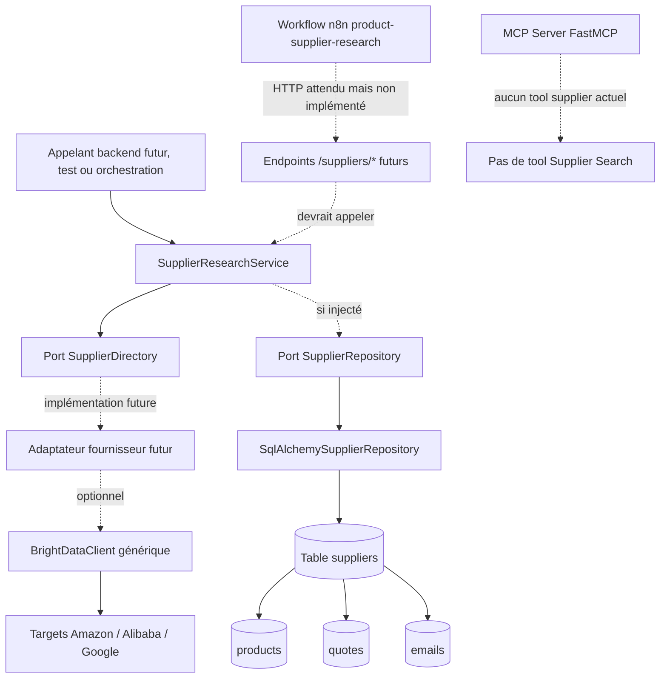
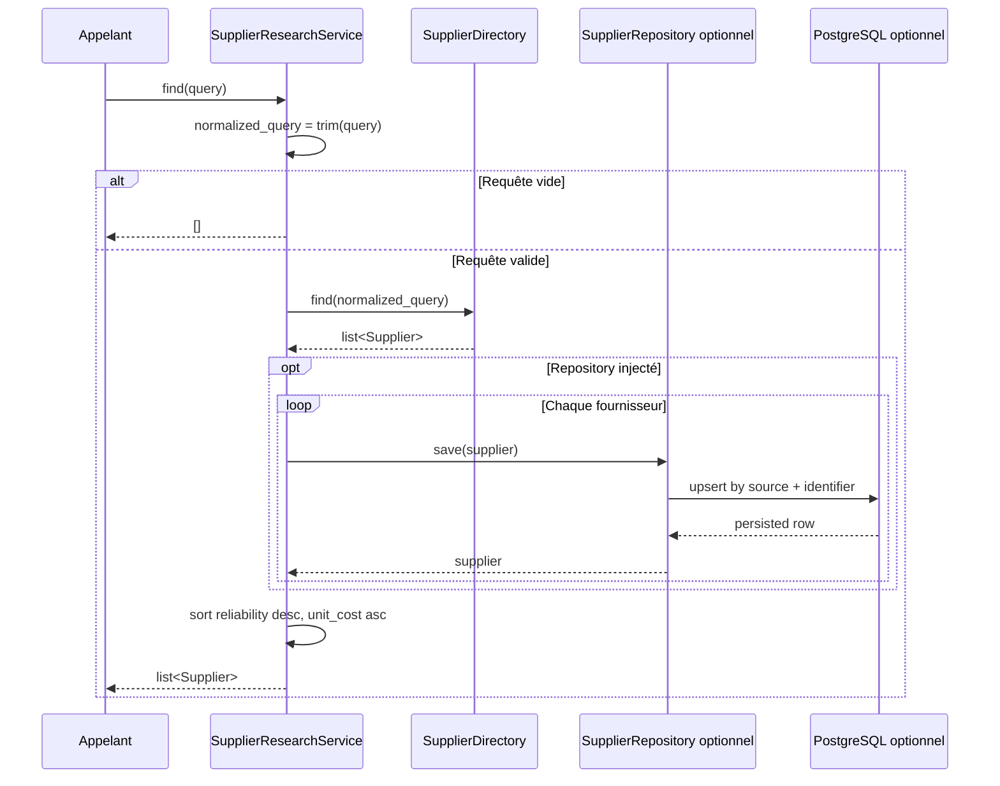
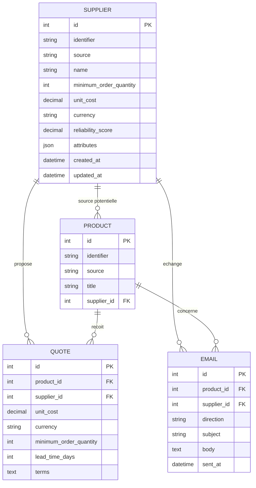

# Fonctionnalité — Supplier Search

> Statut : spécification fonctionnelle et technique basée uniquement sur le code présent au 2026-07-01.  
> Livrable couvert : recherche de fournisseurs via le service backend `SupplierResearchService`, le port `SupplierDirectory`, le modèle domaine `Supplier`, le repository SQLAlchemy fournisseur et le workflow n8n exporté `product-supplier-research`.  
> Important : aucun outil MCP `supplier_search` n'est implémenté dans le code actuel. Les seuls outils MCP réellement enregistrés concernent la recherche produit, l'analyse produit, le calcul de marge et le scoring produit.

## 1. Présentation

### But de la fonctionnalité

La fonctionnalité **Supplier Search** sert à rechercher des fournisseurs candidats pour un besoin de sourcing, à normaliser ces fournisseurs dans un modèle domaine commun, puis à les classer pour aider une décision Amazon FBA.

Dans l'état actuel du repository, cette fonctionnalité existe principalement dans le backend métier :

- un modèle domaine `Supplier` ;
- un port métier `SupplierDirectory` ;
- un service `SupplierResearchService` ;
- un port de persistance `SupplierRepository` ;
- un adaptateur SQLAlchemy `SqlAlchemySupplierRepository` ;
- une entité persistée `Supplier` et des relations vers produits, devis et emails ;
- un connecteur Bright Data générique capable de collecter des données sur les cibles Amazon, Alibaba et Google ;
- un workflow n8n exporté simulant une chaîne produit validé → recherche fournisseurs → analyse → score → notification.

La fonctionnalité n'est pas encore exposée comme tool MCP, ni comme API HTTP backend réellement implémentée.

### Objectifs métier

Les objectifs métier matérialisés ou préparés par le code sont :

1. **Identifier des fournisseurs candidats** à partir d'une requête textuelle.
2. **Normaliser les résultats fournisseurs** dans une entité indépendante des fournisseurs externes.
3. **Prioriser les fournisseurs** selon la fiabilité connue et le coût unitaire connu.
4. **Persister les fournisseurs** lorsque le service reçoit un repository optionnel.
5. **Préparer la suite du sourcing** via les entités `Quote` et `Email`, même si leurs services dédiés ne sont pas encore implémentés.
6. **Permettre l'automatisation future** via le workflow n8n `product-supplier-research`.

### Utilisateurs concernés

- **Utilisateur métier Amazon FBA** : cherche des fournisseurs potentiels pour un produit validé.
- **Développeur backend** : maintient le service supplier, les ports et les repositories.
- **Développeur connecteurs** : peut brancher Bright Data ou un autre fournisseur derrière `SupplierDirectory`.
- **Ingénieur data/automation** : peut importer et adapter le workflow n8n exporté.
- **Agent IA ou orchestrateur futur** : pourra consommer cette capacité si un tool MCP ou une API est ajouté.

### Limites actuelles

- Aucun endpoint HTTP backend `/suppliers/search`, `/suppliers/analyse` ou `/suppliers/score` n'est présent dans le code.
- Aucun tool MCP de recherche fournisseur n'est enregistré.
- Aucun adaptateur concret `SupplierDirectory` basé sur Bright Data, Alibaba ou un autre fournisseur n'est implémenté.
- Le connecteur Bright Data retourne des `BrightDataRecord` génériques, sans mapper fournisseur métier vers `Supplier`.
- Le service ne reçoit qu'une requête texte ; il ne connaît pas directement `product_identifier`, marketplace, catégorie, contraintes de MOQ ou cible de prix.
- Le classement repose uniquement sur `reliability_score` et `unit_cost` quand ces champs existent.
- Il n'existe pas de service d'analyse fournisseur, de scoring fournisseur, de devis ou d'emailing fournisseur.
- Le dashboard Next.js ne présente pas d'écran fournisseur réel.

## 2. Cas d'utilisation

### UC-01 — Rechercher des fournisseurs par requête textuelle

- **Description** : l'appelant transmet une requête métier, par exemple un titre de produit, et récupère des fournisseurs normalisés.
- **Entrée** : chaîne `query`.
- **Sortie** : liste de `Supplier`.
- **Résultat attendu** : les fournisseurs retournés par le `SupplierDirectory` sont classés par fiabilité décroissante, puis par coût unitaire croissant si le coût est connu.

### UC-02 — Ignorer une requête vide ou uniquement composée d'espaces

- **Description** : le service protège la frontière métier contre les recherches sans contenu.
- **Entrée** : chaîne vide, ou chaîne avec uniquement des espaces.
- **Sortie** : liste vide.
- **Résultat attendu** : aucun appel au directory n'est nécessaire et aucun fournisseur n'est persisté.

### UC-03 — Normaliser les espaces de la requête

- **Description** : le service supprime les espaces en début et fin de chaîne avant l'appel au directory.
- **Entrée** : chaîne avec espaces périphériques, par exemple `" coffee press "`.
- **Sortie** : liste de fournisseurs associée à `"coffee press"`.
- **Résultat attendu** : le directory reçoit la requête normalisée.

### UC-04 — Classer les fournisseurs avec scores de fiabilité connus

- **Description** : quand plusieurs fournisseurs ont un `reliability_score`, les plus fiables remontent en premier.
- **Entrée** : fournisseurs avec `reliability_score` différents.
- **Sortie** : liste triée.
- **Résultat attendu** : un fournisseur à `0.9` est avant un fournisseur à `0.4`.

### UC-05 — Classer les fournisseurs à fiabilité égale ou inconnue par coût connu

- **Description** : après la fiabilité, le service privilégie les fournisseurs avec coût connu, puis le coût unitaire le plus bas.
- **Entrée** : fournisseurs avec `unit_cost` renseigné ou non.
- **Sortie** : liste triée.
- **Résultat attendu** : les coûts connus précèdent les coûts inconnus, et les coûts plus faibles précèdent les coûts plus élevés.

### UC-06 — Persister les fournisseurs trouvés

- **Description** : si un `SupplierRepository` est injecté, chaque fournisseur retourné par le directory est sauvegardé avant le tri final.
- **Entrée** : requête texte, directory, repository.
- **Sortie** : liste des fournisseurs sauvegardés puis triés.
- **Résultat attendu** : le repository effectue un upsert logique par couple `(source, identifier)` dans l'adaptateur SQLAlchemy.

### UC-07 — Collecter des données fournisseur via un connecteur externe futur

- **Description** : un adaptateur futur peut implémenter `SupplierDirectory` en utilisant `BrightDataClient.collect(BrightDataTarget.ALIBABA, query)` ou une autre cible.
- **Entrée** : requête texte.
- **Sortie** : fournisseurs domaine après mapping depuis records externes.
- **Résultat attendu** : les règles de sourcing restent dans le service et le mapping fournisseur reste dans l'adaptateur, pas dans le connecteur brut.

### UC-08 — Déclencher un workflow n8n de recherche fournisseur après validation produit

- **Description** : le workflow exporté reçoit un produit validé par webhook, appelle une URL de recherche fournisseur configurée, puis enchaîne analyse, score et notification.
- **Entrée** : payload webhook contenant `product_identifier` ou `asin`, `title` et éventuellement `marketplace`.
- **Sortie** : payload final envoyé à une URL de notification.
- **Résultat attendu** : automatisation importable dans n8n, mais dépendante d'endpoints HTTP non présents dans le backend actuel.

## 3. Architecture

### Modules impliqués

- `backend/src/fba_advisor/domain/models.py` : modèle domaine `Supplier`.
- `backend/src/fba_advisor/ports/catalog.py` : port `SupplierDirectory`.
- `backend/src/fba_advisor/ports/repositories.py` : port `SupplierRepository`.
- `backend/src/fba_advisor/services/supplier/service.py` : service métier `SupplierResearchService`.
- `backend/src/fba_advisor/repositories/sqlalchemy.py` : repository `SqlAlchemySupplierRepository`.
- `backend/src/fba_advisor/models/entities.py` : entités SQLAlchemy `Supplier`, `Product`, `Quote`, `Email` et relations.
- `backend/src/fba_advisor/connectors/brightdata/*` : connecteur externe générique qui peut servir de source future.
- `workflows/n8n/product-supplier-research.json` : orchestration n8n exportée.

### Services

- `SupplierResearchService` est le seul service backend spécifique à cette fonctionnalité.
- Aucun service d'analyse fournisseur ou scoring fournisseur n'est présent.

### Outils MCP

Aucun outil MCP fournisseur n'existe actuellement.

Les outils MCP réellement présents dans le repository sont uniquement :

- `search_products` ;
- `analyse_product` ;
- `calculate_margin` ;
- `score_product`.

### Connecteurs

- Aucun connecteur n'est directement câblé au service supplier.
- `BrightDataClient` existe comme connecteur générique pour Amazon, Alibaba et Google, mais il n'implémente pas `SupplierDirectory`.

### Base de données

La base relationnelle contient une table `suppliers` et des relations depuis :

- `products.supplier_id` vers `suppliers.id` ;
- `quotes.supplier_id` vers `suppliers.id` ;
- `emails.supplier_id` vers `suppliers.id`.

### Dépendances

- Python standard library pour le transport HTTP `urllib` côté Bright Data.
- Pydantic pour les modèles connecteur Bright Data.
- SQLAlchemy pour la persistance.
- PostgreSQL comme base cible via Docker Compose et `DATABASE_URL`.
- n8n uniquement sous forme de workflow JSON exporté.

### Diagramme Mermaid



## 4. Flux d'exécution

### Flux backend réellement implémenté

1. L'appelant instancie `SupplierResearchService` avec un `SupplierDirectory`.
2. L'appelant peut injecter un `SupplierRepository` optionnel.
3. L'appelant appelle `find(query)`.
4. Le service exécute `query.strip()`.
5. Si la requête normalisée est vide, le service retourne `[]`.
6. Le service appelle `SupplierDirectory.find(normalized_query)`.
7. Si un repository est injecté, chaque fournisseur est sauvegardé via `SupplierRepository.save`.
8. Le service trie les fournisseurs selon :
   1. présence d'un `reliability_score` connu ;
   2. `reliability_score` décroissant ;
   3. présence d'un `unit_cost` connu ;
   4. `unit_cost` croissant.
9. Le service retourne la liste triée.

### Flux n8n exporté

1. Un webhook `product-validated` reçoit un produit validé.
2. Un noeud HTTP `Recherche fournisseurs` appelle `SUPPLIER_SEARCH_URL` ou `http://backend:8000/suppliers/search`.
3. Un noeud HTTP `Analyse` appelle `SUPPLIER_ANALYSIS_URL` ou `http://backend:8000/suppliers/analyse`.
4. Un noeud HTTP `Score` appelle `SUPPLIER_SCORE_URL` ou `http://backend:8000/suppliers/score`.
5. Un noeud HTTP `Notification` appelle `NOTIFICATION_WEBHOOK_URL`.

Ce flux est exporté mais non exécutable tel quel contre le backend actuel, car les endpoints HTTP référencés ne sont pas implémentés.

### Diagramme Mermaid



## 5. Outils MCP utilisés

Aucun outil MCP n'est utilisé par Supplier Search dans l'état actuel du code.

### État MCP actuel

| Tool MCP | Rôle | Lien avec Supplier Search |
| --- | --- | --- |
| `search_products` | Recherche de produits Amazon via use cases produit. | Aucun appel fournisseur. |
| `analyse_product` | Analyse produit. | Aucun appel fournisseur. |
| `calculate_margin` | Estimation de marge. | Peut consommer un coût fournisseur en théorie, mais ne recherche pas de fournisseur. |
| `score_product` | Scoring produit legacy. | Utilise une valeur fixe de fiabilité fournisseur dans le use case actuel, pas Supplier Search. |

### Tool fournisseur futur recommandé

Si un tool MCP est ajouté plus tard, il devrait avoir un contrat minimal de ce type :

- **Rôle** : exposer `SupplierResearchService.find` à un agent.
- **Paramètres** : `query` obligatoire ; éventuellement `product_identifier`, `marketplace`, `limit`, `min_reliability`, `max_unit_cost` après décision d'architecture.
- **Retour** : liste de fournisseurs normalisés avec `identifier`, `name`, `source`, `minimum_order_quantity`, `unit_cost`, `currency`, `reliability_score`, `attributes`.
- **Dépendances** : service supplier, implémentation `SupplierDirectory`, repository optionnel, gestion d'erreurs MCP similaire aux tools existants.

## 6. Services impliqués

### SupplierResearchService

**Responsabilités :**

- valider minimalement la requête par trimming ;
- refuser les recherches vides par retour de liste vide ;
- déléguer la collecte à `SupplierDirectory` ;
- sauvegarder les fournisseurs si un repository est injecté ;
- trier les fournisseurs selon des signaux déjà normalisés.

**Dépendances :**

- `SupplierDirectory` obligatoire ;
- `SupplierRepository` optionnel.

**Non-responsabilités :**

- appeler Bright Data directement ;
- gérer l'authentification fournisseur ;
- parser des payloads externes ;
- calculer une marge ;
- envoyer des emails ;
- scorer un fournisseur avec pondérations avancées.

## 7. Connecteurs

### Connecteurs utilisés directement

Aucun connecteur n'est utilisé directement par `SupplierResearchService`.

### Bright Data

**Pourquoi il est pertinent :** le connecteur Bright Data est générique et supporte les cibles `AMAZON`, `ALIBABA` et `GOOGLE`. La cible `ALIBABA` est un candidat naturel pour une implémentation future de `SupplierDirectory`.

**État actuel :**

- `BrightDataClient.collect(target, query)` construit une requête HTTP GET vers `/collect` avec `target`, `query` et éventuellement `zone`.
- Le client ajoute un header `Authorization: Bearer <api_token>`.
- Le retour est mappé en `BrightDataResponse` contenant des `BrightDataRecord` génériques.
- Aucun mapping `BrightDataRecord` → `Supplier` n'existe actuellement.

### Autres connecteurs

- Amazon : utilisé pour la recherche produit, pas pour Supplier Search.
- Keepa : utilisé pour l'analyse produit, pas pour Supplier Search.
- OpenAI : utilisé par le service OpenAI/prompting, pas par Supplier Search.

## 8. Modèle de données

### Entité domaine `Supplier`

Champs :

- `identifier` : identifiant stable chez la source.
- `name` : nom du fournisseur.
- `source` : nom du provider ou de l'adaptateur.
- `minimum_order_quantity` : quantité minimale de commande, optionnelle.
- `unit_cost` : coût unitaire, optionnel.
- `currency` : devise ISO courte, optionnelle.
- `reliability_score` : score de fiabilité optionnel.
- `attributes` : dictionnaire extensible pour données provider ou signaux complémentaires.

### Entité persistée `suppliers`

La table `suppliers` contient :

- clé primaire `id` ;
- contrainte d'unicité `(source, identifier)` ;
- index sur `name` ;
- champs de sourcing : MOQ, coût, devise, fiabilité ;
- `attributes` en JSON/JSONB ;
- timestamps `created_at` et `updated_at`.

### Relations

- Un fournisseur peut être lié à plusieurs produits via `Product.supplier_id`.
- Un fournisseur peut avoir plusieurs devis via `Quote.supplier_id`.
- Un fournisseur peut avoir plusieurs emails via `Email.supplier_id`.

### Diagramme Mermaid



## 9. Algorithme

### Algorithme actuel

1. Recevoir `query`.
2. Calculer `normalized_query` en supprimant les espaces en début et fin.
3. Si `normalized_query` est vide : retourner une liste vide.
4. Appeler `directory.find(normalized_query)`.
5. Si `repository` existe : remplacer la liste par les résultats de `repository.save(supplier)` pour chaque fournisseur.
6. Trier la liste avec la clé suivante :
   - fournisseurs avec `reliability_score` renseigné avant ceux sans score ;
   - `reliability_score` décroissant ;
   - fournisseurs avec `unit_cost` renseigné avant ceux sans coût ;
   - `unit_cost` croissant.
7. Retourner la liste triée.

### Pseudo-code

```text
fonction rechercher_fournisseurs(query):
    requete = trim(query)

    si requete est vide:
        retourner liste_vide

    fournisseurs = directory.find(requete)

    si repository existe:
        fournisseurs_sauvegardes = liste_vide
        pour chaque fournisseur dans fournisseurs:
            fournisseurs_sauvegardes.ajouter(repository.save(fournisseur))
        fournisseurs = fournisseurs_sauvegardes

    trier fournisseurs par:
        score_fiabilite_absent en dernier
        score_fiabilite décroissant
        cout_unitaire_absent en dernier
        cout_unitaire croissant

    retourner fournisseurs
```

### Exemple de classement

Si le directory retourne :

1. Fournisseur A : fiabilité `0.4`, coût absent.
2. Fournisseur B : fiabilité `0.9`, coût absent.
3. Fournisseur C : fiabilité absente, coût `8.00`.

Le résultat attendu est : B, A, C.

## 10. Configuration

### Variables d'environnement présentes

Le fichier `.env.example` contient :

- `APP_ENV` ;
- `LOG_LEVEL` ;
- `POSTGRES_DB` ;
- `POSTGRES_USER` ;
- `POSTGRES_PASSWORD` ;
- `POSTGRES_HOST` ;
- `POSTGRES_PORT` ;
- `DATABASE_URL`.

Aucune variable Bright Data, Alibaba, supplier ou n8n n'est définie dans `.env.example`.

### Paramètres du workflow n8n

Le workflow `product-supplier-research` référence :

- `SUPPLIER_SEARCH_URL` avec fallback `http://backend:8000/suppliers/search` ;
- `SUPPLIER_ANALYSIS_URL` avec fallback `http://backend:8000/suppliers/analyse` ;
- `SUPPLIER_SCORE_URL` avec fallback `http://backend:8000/suppliers/score` ;
- `NOTIFICATION_WEBHOOK_URL` sans fallback.

Ces paramètres sont utilisés par n8n, mais les services HTTP correspondants ne sont pas présents dans le backend actuel.

### Pondérations

Aucune pondération dédiée à Supplier Search n'existe dans un fichier de configuration.

Le tri actuel est codé dans le service selon la priorité suivante :

1. score de fiabilité présent ;
2. score de fiabilité le plus élevé ;
3. coût unitaire présent ;
4. coût unitaire le plus faible.

### Fichiers de configuration liés

- `.env.example` pour PostgreSQL et environnement applicatif.
- `docker-compose.yml` pour le service PostgreSQL et les services Python.
- `workflows/n8n/product-supplier-research.json` pour les URLs n8n.
- Aucun `config.yaml` supplier dédié.

## 11. Gestion des erreurs

### Erreurs possibles

| Erreur | Source | Comportement actuel | Stratégie de reprise attendue |
| --- | --- | --- | --- |
| Requête vide | Appelant | Retour `[]`. | Corriger la requête côté appelant. |
| Directory indisponible | Implémentation `SupplierDirectory` | Non intercepté par le service. | L'adaptateur ou la frontière protocolaire future doit convertir l'erreur. |
| Payload externe invalide | Connecteur futur, Bright Data | Bright Data peut lever une erreur de parsing. | Mapper en erreur contrôlée à la frontière HTTP/MCP future. |
| Réponse API externe >= 400 | Bright Data | `BrightDataAPIError`. | Retenter selon politique externe, journaliser sans secret, retourner erreur contrôlée. |
| JSON externe invalide | Bright Data | `BrightDataParsingError`. | Marquer le provider comme temporairement invalide et ne pas persister de données partielles. |
| Erreur de persistance | SQLAlchemy/PostgreSQL | Non interceptée par le repository. | Rollback dans l'unité de travail appelante ; ne pas masquer l'échec. |
| Doublon fournisseur | SQLAlchemy repository | Upsert applicatif par `(source, identifier)`. | Mettre à jour l'entité existante. |
| Score ou coût invalide | Données provider | Pas de validation métier avancée dans le service. | Ajouter validation dans l'adaptateur `SupplierDirectory` futur. |

### Comportement attendu

- Le service métier reste simple et déterministe.
- Les erreurs d'infrastructure doivent être gérées dans les adaptateurs ou frontières protocolaires.
- Les secrets ne doivent jamais apparaître dans les messages d'erreur.
- La persistance ne doit pas enregistrer de fournisseur partiellement mappé si les champs obligatoires sont absents.

## 12. Logging

Aucun logging spécifique n'est présent dans `SupplierResearchService`.

### À journaliser dans une implémentation future

- Début d'une recherche fournisseur avec longueur de requête ou hash non réversible, pas la donnée sensible complète si elle contient un produit confidentiel.
- Nombre de fournisseurs retournés par le directory.
- Nombre de fournisseurs persistés.
- Provider utilisé derrière `SupplierDirectory`.
- Erreurs provider, parsing et persistance.
- Temps de réponse de la collecte externe.

### Niveaux recommandés

- `DEBUG` : détail de tri, provider choisi, informations techniques sans secrets.
- `INFO` : recherche exécutée, nombre de résultats, persistance réussie.
- `WARNING` : fournisseur ignoré pour données incomplètes, provider partiellement indisponible.
- `ERROR` : échec de provider externe, erreur parsing, erreur SQLAlchemy.

### Événements importants

- `supplier_search_started`.
- `supplier_directory_completed`.
- `supplier_persistence_completed`.
- `supplier_search_empty_query`.
- `supplier_search_failed`.

## 13. Tests

### Tests unitaires existants

Un test backend vérifie que `SupplierResearchService` :

- utilise un directory injecté ;
- normalise la requête ;
- classe les résultats par fiabilité décroissante.

Les tests connecteurs vérifient aussi que `BrightDataClient` :

- supporte plusieurs targets ;
- transmet `target=alibaba` ;
- transmet `zone` ;
- ajoute le header bearer ;
- mappe les records génériques.

### Tests d'intégration existants

Les tests repositories couvrent les repositories SQLAlchemy. La persistance fournisseur doit être maintenue dans ce périmètre lorsqu'elle évolue.

### Cas limites à couvrir

- Requête vide.
- Requête avec espaces périphériques.
- Directory retournant une liste vide.
- Fournisseurs avec scores de fiabilité absents.
- Fournisseurs avec coûts absents.
- Fournisseurs à score égal et coûts différents.
- Repository optionnel absent.
- Repository présent avec fournisseur déjà existant.
- Erreur provider externe.
- Payload Bright Data sans `records` ni `data` valides.

### Données de test recommandées

- Fournisseur fiable : `identifier=S2`, `name=High reliability`, `reliability_score=0.9`.
- Fournisseur moins fiable : `identifier=S1`, `name=Low reliability`, `reliability_score=0.4`.
- Fournisseur à coût bas : `unit_cost=5.00`, `currency=USD`.
- Fournisseur sans score : `reliability_score=None`.
- Payload Bright Data Alibaba : record avec `id`, `title`, `url`.

### Checklist

- [ ] Le service retourne `[]` pour une requête vide.
- [ ] Le service trim la requête avant d'appeler le directory.
- [ ] Le tri place les scores connus avant les scores absents.
- [ ] Le tri place les scores les plus hauts en premier.
- [ ] Le tri place les coûts connus avant les coûts absents.
- [ ] Le tri place les coûts les plus faibles en premier à fiabilité équivalente.
- [ ] Le repository est appelé une fois par fournisseur quand il est injecté.
- [ ] L'upsert SQLAlchemy respecte `(source, identifier)`.
- [ ] Les erreurs Bright Data sont converties à la frontière future.
- [ ] Aucun secret provider n'apparaît dans les logs ou erreurs.

## 14. Performance

### Points sensibles

- Appels externes fournisseur potentiellement lents.
- Pagination provider non définie.
- Absence de limite de résultats dans `SupplierResearchService.find`.
- Persistance séquentielle fournisseur par fournisseur.
- Tri en mémoire de toute la liste.
- Absence de cache.

### Optimisations possibles

- Ajouter un paramètre `limit` à une frontière applicative future.
- Implémenter la pagination dans l'adaptateur `SupplierDirectory`.
- Dédupliquer les fournisseurs avant persistance.
- Grouper les upserts SQL si le volume devient important.
- Mettre en cache les recherches par `(provider, normalized_query)` avec TTL.
- Stocker une date de fraîcheur dans `attributes` ou une colonne dédiée après décision de schéma.

### Cache éventuel

Aucun cache n'existe actuellement. Un cache futur devrait :

- être externe au domaine ;
- ne pas modifier le contrat `SupplierDirectory` ;
- inclure le provider et la requête normalisée dans la clé ;
- respecter une durée courte, car prix et disponibilité fournisseurs peuvent changer.

## 15. Sécurité

### Validations

- Validation actuelle : requête trimée et rejet implicite des chaînes vides.
- Validations absentes : longueur maximale, caractères interdits, marketplace autorisée, bornes de score, devise autorisée, coût positif.

### Secrets

- Les credentials Bright Data sont modélisés par `BrightDataCredentials.api_token` et `zone`.
- Aucun secret Bright Data n'est présent dans `.env.example`.
- Les tokens ne doivent jamais être persistés dans `Supplier.attributes` ni journalisés.

### Permissions

- Aucune authentification applicative backend ou MCP fournisseur n'est présente.
- Les endpoints n8n référencés sont des URLs attendues, pas des contrôles d'accès implémentés.
- Toute exposition HTTP ou MCP future doit vérifier les permissions de l'appelant.

### Données sensibles

Données potentiellement sensibles :

- noms et URLs de fournisseurs ;
- prix négociés ;
- MOQ ;
- conditions commerciales ;
- emails fournisseur ;
- attributs raw provider.

Les données raw dans `attributes` doivent être traitées comme sensibles jusqu'à preuve contraire.

## 16. Dépendances

### Dépendances internes

- `fba_advisor.domain.models.Supplier`.
- `fba_advisor.ports.catalog.SupplierDirectory`.
- `fba_advisor.ports.repositories.SupplierRepository`.
- `fba_advisor.services.supplier.SupplierResearchService`.
- `fba_advisor.repositories.sqlalchemy.SqlAlchemySupplierRepository`.
- `fba_advisor.models.entities.Supplier`.
- `fba_advisor.models.entities.Product`.
- `fba_advisor.models.entities.Quote`.
- `fba_advisor.models.entities.Email`.
- Tests backend de services et repositories.

### Dépendances externes

- SQLAlchemy.
- PostgreSQL.
- Pydantic.
- Bright Data API, uniquement via connecteur générique existant.
- n8n, uniquement via workflow JSON exporté.
- `urllib` de la bibliothèque standard pour le transport Bright Data.

## 17. Roadmap

### Version actuelle

- Service backend `SupplierResearchService`.
- Modèle domaine `Supplier`.
- Ports `SupplierDirectory` et `SupplierRepository`.
- Repository SQLAlchemy fournisseur.
- Table `suppliers` et relations avec produits, devis et emails.
- Connecteur Bright Data générique non câblé au service supplier.
- Workflow n8n exporté mais dépendant d'endpoints non présents.

### V2

- Ajouter un adaptateur concret `SupplierDirectory` basé sur Bright Data Alibaba ou une autre source.
- Ajouter un mapper `BrightDataRecord` → `Supplier` dans un adaptateur repository/connecteur, pas dans le service métier.
- Ajouter une façade applicative supplier similaire à `ProductToolUseCases`.
- Ajouter un tool MCP `search_suppliers` avec schémas Pydantic.
- Ajouter une gestion d'erreurs contrôlée à la frontière MCP.
- Ajouter des tests unitaires et MCP pour le tool fournisseur.

### V3

- Ajouter une API HTTP backend si l'ADR futur valide ce protocole.
- Rendre le workflow n8n réellement exécutable contre les endpoints existants.
- Ajouter analyse fournisseur et scoring fournisseur.
- Relier fournisseurs, devis et produits dans les use cases.
- Ajouter un dashboard de comparaison fournisseurs.
- Ajouter cache, pagination et limites de résultats.

### Améliorations futures

- Détection de doublons multi-sources.
- Normalisation des devis et délais.
- Scoring fournisseur configurable.
- Enrichissement par OpenAI via prompts dédiés.
- Historique de prix fournisseur.
- Workflow d'emailing contrôlé avec validation humaine.

## 18. Dette technique

### P0

- Les endpoints HTTP référencés par n8n n'existent pas ; le workflow ne peut pas fonctionner contre le backend actuel.
- Aucun tool MCP fournisseur n'existe malgré l'objectif d'interface agentique principale.

### P1

- Aucun adaptateur concret `SupplierDirectory` n'est fourni.
- Le connecteur Bright Data n'est pas mappé vers le domaine `Supplier`.
- Le service n'accepte pas de paramètres métier riches comme marketplace, MOQ max, prix cible ou limite de résultats.
- Aucune validation avancée des données fournisseur.
- Aucun logging supplier dédié.

### P2

- Aucun cache de recherche fournisseur.
- Aucun scoring fournisseur configurable.
- Aucun écran frontend supplier.
- Les entités `Quote` et `Email` existent sans services métier dédiés.
- Les données raw dans `attributes` n'ont pas de politique de minimisation documentée dans le code.

## 19. ADR liées

- **ADR-001 — Monorepo applicatif privé** : Supplier Search traverse backend, migrations, connecteurs, workflows et documentation.
- **ADR-002 — Clean Architecture** : le service dépend de ports `SupplierDirectory` et `SupplierRepository`, pas de connecteurs concrets.
- **ADR-003 — Backend Python importable** : Supplier Search est aujourd'hui une capacité de package backend, pas un endpoint HTTP autonome.
- **ADR-004 — Serveur MCP FastMCP comme interface agentique principale** : tout futur tool supplier devra déléguer au backend, pas réimplémenter la logique.
- **ADR-005 — Connecteurs fournisseurs isolés** : Bright Data doit rester un connecteur d'infrastructure, avec mapping vers domaine hors du service métier.
- **ADR-006 — Repository Pattern pour la persistance métier** : la table `suppliers` et les repositories SQLAlchemy suivent la séparation domaine/persistance.

## 20. Impact sur le reste du projet

### Modules impactés

Dans l'état actuel, la documentation de Supplier Search concerne :

- backend domaine ;
- backend ports ;
- backend service supplier ;
- backend repositories SQLAlchemy ;
- modèles SQLAlchemy ;
- connecteur Bright Data ;
- workflows n8n ;
- tests backend.

Aucun module frontend ou MCP n'est impacté par une modification documentaire seule.

### Risques

- Confondre le workflow n8n exporté avec une capacité backend HTTP réellement disponible.
- Câbler Bright Data directement dans le service et violer la Clean Architecture.
- Persister des payloads raw sensibles sans minimisation.
- Ajouter un tool MCP supplier sans schémas et gestion d'erreurs cohérents avec les tools existants.
- Ajouter un scoring fournisseur dans le service de recherche au lieu de créer une responsabilité dédiée.

### Compatibilité

- La fonctionnalité actuelle est compatible avec les services existants car elle est isolée derrière ses ports.
- Ajouter un adaptateur `SupplierDirectory` ne devrait pas casser le domaine si le contrat `find(query) -> list[Supplier]` est conservé.
- Ajouter un repository optionnel reste rétrocompatible avec les tests existants.
- Ajouter des paramètres à `SupplierResearchService.find` serait une rupture et devrait passer par une nouvelle méthode ou une façade applicative versionnée.
- Toute exposition MCP ou HTTP doit préserver les contrats backend et documenter les consommateurs n8n/front futurs.
